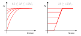
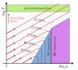

# Main sequence and beyond

Goals:

- Eddington grey boundary conditions
- Main-sequence location in the HR diagram
- Basic structure in the main sequence
- Evolution in the $\rho_\mathrm{c}$-$T_\mathrm{c}$ diagram

## Eddington grey boundary conditions

So far we have made the simplification $P(M)=0$, as this makes analytical solutions easier. But in practice a star has a fuzzy atmosphere, where at some point radiation decouples from matter and most photons stream freely outwards. As collisions become less frequent, with larger mean free paths, matter as well deviates from a state of local thermodynamical equilibrium. Normally when we compute a stellar model we restrict the simulation domain to its photosphere, for which we havee an effective temperature $T_\mathrm{eff}$. This temperature can be defined as

$$L(R_\mathrm{p})=4\pi R_\mathrm{p}^2\sigma T_\mathrm{eff}^4,$$

and the photosphere radius $R_\mathrm{p}$ is the location where

$$T(R_\mathrm{p})=T_\mathrm{eff}.$$

said differently, it is the point that satisfies

$$T(R_\mathrm{p})=\left(\frac{L(R_\mathrm{p})}{4\pi R_\mathrm{p}^2\sigma}\right)^{1/4}.$$

Formally treating a stellar atmosphere is quite an involved process, so we usually make use of an approximation devised by Arthur Eddington, the Eddington grey atmosphere. Grey refers to ignoring opacity variations throughout the atmosphere. We start with the result we derived when studying radiative energy transport, which says that in a radiative layer the temperature gradient is giveen by

$$\frac{\partial T}{\partial r}=-\frac{3\kappa \rho L}{16acT^3\pi r^2},\quad P_\mathrm{r}=\frac{a}{3}T^4.\tag{10.1}$$

Since we have

$$\frac{\partial P_\mathrm{r}}{\partial r}=\frac{4}{3}aT^3\frac{\partial T}{\partial r},$$

we can write $(10.1)$ as

$$\frac{\partial P_\mathrm{r}}{\partial r}=-\frac{-\kappa\rho}{c}\frac{L}{4\pi r^2}.\tag{10.2}$$

As we move away from the photosphere, the radiation field $I_\nu$ (flux per unit frequency, time and solid angle in a specific direction) deviates from isotropy and instead points preferentially outwards. At this point $(10.1)$ does not hold as $I_\nu\neq B_\nu$ and we assumed a Planck distribution for radiation to derive it. However, the Eddington approximation still uses $(10.2)$ with the radiation pressure being given by

$$P_\mathrm{r}=\int_0^{2\pi}\int_0^\pi\int_0^\infty\frac{I_\nu(\theta,\phi)}{c}\cos^2\theta\sin\theta\mathrm{d}\nu\mathrm{d}\theta\mathrm{d}\phi.$$

The above epression can be derived using similar arguments to our derivation of pressure from an isotropic distribution of momenta. Taking $\theta$ to be the polar angle with respect to the radial direction and assuming radial symmetry we have $I_\nu(\theta,\phi)=I_\nu(\theta)$. Moreover, we have

$$\int_0^\infty I_\nu(\theta) \mathrm{d}\nu=I(\theta),$$

such that

$$P_\mathrm{r}=\frac{2\pi}{c}\int_0^\pi I(\theta)\cos^2(\theta)\sin(\theta)\mathrm{d}\theta,$$
$$=\frac{2\pi}{c}\int_{-1}^1I(\mu)\mu^2\mathrm{d}\mu,\;\mu\equiv\cos\theta.$$

Similarly, the flux is given by

$$F=2\pi\int_{-1}^1 I(\mu)\mu \mathrm{d}\mu,$$

which applies throughout the entire star, meaning that we always need at least a small amount of anisotropy to transport energy through radiation. In practice in the deep stellar interior tiny variations from $B_\nu$ are sufficient for this.

Now let us assume we have a thin photosphere where

$$\frac{L(r)}{4\pi r^2}=F(r)\simeq \mathrm{constant},$$

and let us use optical depth as a variable,

$$\mathrm{d}\tau=-\kappa\rho\mathrm{d}r,\quad \tau=0\quad \mathrm{at}\quad r=\infty,$$

which allows us to rewrite $(10.2)$ as

$$\frac{\partial P_\mathrm{r}}{\partial\tau}=\frac{F}{c}\rightarrow P_\mathrm{r}=\frac{F}{c}\tau+P_\mathrm{\tau=0}.\tag{10.3}$$

In the Eddington approximation we assume that across the atmosphere we also have

$$P_\mathrm{r}=\frac{1}{3}aT^4,$$

and we also take the intensity to be constant in outgoing directions,

$$I(\mu,\tau=0)=\begin{cases}I_0 & 0\leq \mu \leq 1 \\ 0 & -1 \leq \mu < 0.\end{cases}$$

Computing the pressure and flux associated to this we get

$$P_r(\tau=0)=\frac{2\pi}{c}\int_0^1I_0\mu^2\mathrm{d}\mu=\frac{2\pi}{3c}I_0,$$
$$F(\tau=0)=2\pi\int_0^1I_0\mu\mathrm{d}\mu=\pi I_0,$$

such that

$$P_\mathrm{\tau=0}=\frac{2F(\tau=0)}{3c}.$$

Replacing in $(10.3)$ together with the assumption of constant flux through the thin atmosphere we get

$$\frac{1}{3}aT^4=\frac{F}{c}\tau +\frac{2F}{3c}=\frac{2F}{3c}\left(\frac{3}{2}\tau + 1\right)$$

and finally, sincee $F=\sigma T_\mathrm{eff}^4, we have that$

$$T^4=\frac{T_\mathrm{eff}^4}{2}\left(\frac{3}{2}\tau+1\right).$$

This gives us that the optical depth of the photosphere, where $T=T_\mathrm{eff}$, is at $\tau_\mathrm{p}=2/3$. In a stellar model we can set the outer boundary to be at $\tau=2/3$ and use as a boundary condition on temperature that

$$T(\tau=2/3)=\left(\frac{L(\tau=2/3)}{4\pi [r(\tau=2/3)]^2\sigma}\right)^{1/4}.$$

This is not enough though, as we need an additional outer boundary condition. For this purpose we can build a boundary condition using the equation of hydrostatic equilibrium,

$$\frac{\partial P}{\partial r}=-g\rho,\quad g\equiv \frac{Gm(r)}{r^2}.$$

Changing variables to $\tau$ we get

$$\frac{\partial P}{\partial \tau}=\frac{g}{\kappa}.$$

By using the thin atmosphere approximation, with $g\simeq g_\mathrm{s}\equiv GM/R^2$ taken as a constant, together with the grey atmosphere approximation ($\kappa=\mathrm{constant}$) we find that

$$P(\tau=2/3)=\frac{2g_\mathrm{s}}{3\kappa(\tau=2/3)}+P(\tau=0).$$

The pressure at $P(\tau=0)$ is given by $P_\mathrm{r}(\tau=0), but in many cases it can be neglected. It is important though for very luminous stars near the Eddington limit.

## The main sequence in the Hertzsprung-Russel diagram

Now that we have a way to connect luminosity and radius to effective temperature, we can use our homology relationships to discuss the shape of the main sequence. We start from the mass radius relationship that we derived for both PP and CNO burning,

$$R\propto M^{0.43}\;\mathrm{(PP)},\quad R\propto M^{0.81}\;\mathrm{(CNO)}.$$

We also derived a mass luminosity relationship,

$L\propto M^3,$

although the opacity dependence can have a significant impact on the exponent that we ignore now. We can relate $R$ and $L$ to the effective temperature,

$$T_\mathrm{eff}^4 \propto \frac{L}{R^2},$$

which combined with the mass-radius and mass-luminosity relationships above give us the scaling of the effective temperature with mass for zero-age main sequence stars.

$$T_\mathrm{eff}\propto M^{0.54}\;\mathrm{(PP)},\quad T_\mathrm{eff}\propto M^{0.35}\;\mathrm{(CNO)}.$$

This reproduces qualitatively the properties of the main sequence where more massive and luminous stars have a higher effective temperature. Additionally, luminosities cover several orders of magnitude for stars of different masses while variations in effective temperature are much more limited.

We can also make use of our surface boundary conditions to determine the properties of another prominent feature in the HR diagram, the Hayashi line. This is the locus populated by fully convective stars for which a specific opacity source ($\mathrm{H}^{-}$) is critical. The physics of the Hayashi line are much more involved though, and it is left as a reading assignment (Chapter 24 of the Kippenhahn textbook).

## Basic main sequence structure

A simple thing we can check is how stars transition from PP to CNO burning being dominant as we consider higher masses. In particular we have from zero-age main-sequence homology that the central temperature scales with mass as

$$T_\mathrm{c}\propto M^{-0.29}\;\mathrm{(PP)},\;M^{-1.4}\;\mathrm{(CNO)}.$$

If we consider the ratio between the energy generation rates from PP and CNO, we find that

$$\frac{\varepsilon_{\mathrm{PP,c}}}{\varepsilon_{\mathrm{CNO,c}}}=\frac{\varepsilon_{\mathrm{0,PP}\rho_\mathrm{c}}T_\mathrm{c}^{\nu,\mathrm{PP}}}{\varepsilon_{\mathrm{0,CNO}}\rho_\mathrm{c}T_\mathrm{c}^{\nu,\mathrm{CNO}}}\propto T_\mathrm{c}^{\nu,\mathrm{PP}- \nu,\mathrm{CNO}},\tag{10.4}$$

where we distinguish between the power exponents for PP ($\nu,\mathrm{PP}\simeq 4$) and CNO burning ($\nu,\mathrm{CNO}\simeq 18$). Let us assume that at a certain mass burning is completely dominated by the PP chain, such that the relationship $T_\mathrm{c}\propto M^{-0.29}$ for PP burning holds and $(10.4)$ gives

$$\frac{\varepsilon_{\mathrm{PP,c}}}{\varepsilon_{\mathrm{CNO,c}}}\propto M^{0.57(\nu,\mathrm{PP}- \nu,\mathrm{CNO})}.$$

The exponent is significantly smaller than zero, meaning that there is a narrow range in masses where there is a switch between PP burning being absolutely dominant and CNO burning being the one dominating energy generation. This also serves to justify our use of either PP burning or CNO burning for the scaling of $\varepsilon_\mathrm{nuc}$.

The shift from PP to CNO drives an important change on how energy is transported in stellar interiors. Stars with masses similar to the Sun have radiative cores and convective envelopes, while the inverse is the case for more massive stars, the shift being around $1.5M_\odot$. Stars below $\sim0.5M_\odot$ are completely convective during the main sequence. 

As a star evolves in the main sequence it depletes core hydrogen. solar mass stars and high mass stars show a distinctive difference in their abundance profiles as they evolve towards core-hydrogen depletion. Low mass stars exhibit a smooth composition profile with hydrogen mass fractions having their lowest value at the core, while intermediate and massive stars have well mixed cores where hydrogen is kept at a nearly fixed abundance.

As illustrated above, the convective cores of intermediate and massive stars recede in the mass coordinate as the star evolves. This reduction of the convective core mass is partially explained by the lowered opacity of helium rich material. As deep in the stellar interior opacity is well approximated by electron scattering, $\kappa_\mathrm{es}=0.2(1+X)\;\mathrm{cm^2\,g^{-1}}$, and as $\nabla_\mathrm{rad}\propto \kappa_\mathrm{es}$ a decrease in $X$ decreases $\nabla_\mathrm{rad}$ favoring convective stability. Although this is an important element, one needs to be careful with this argument as $\nabla_\mathrm{rad}$ depends on various other properties that do not remain fixed as the star evolves.

## Evolution in the $\rho_\mathrm{c}$-$T_\mathrm{c}$ diagram

Thinking beyond the main sequence we can make use of our results so far to discuss the conditions under which stars ignote different nuclear fuels. Before $H$ is ignited, or in-between burning phases, evolution can be approximately described by homologous contraction. Beyond the main sequence the hydrogen envelope can expand significantly, but the helium core will contract near-homologously. Using our homology relationships derived in the previous class we find that

$$\rho_\mathrm{c}\propto MR^{-1},\quad \rho_\mathrm{c}\propto MR^{-3}.$$

Since we have

$$R^{-1}\propto T_\mathrm{c}M^{-1},$$

we get

$$\rho_\mathrm{c}\propto M^{-2}T_\mathrm{c}^3\;\rightarrow\; \log T_\mathrm{c} =\frac{2}{3}\log M + \frac{1}{3}\log \rho_\mathrm{c}.$$

This indicates that at the same central density stars of higher mass have a higher central temperature.

Now, these homology relationships were made using an ideal gas equation of state but they can break down as we reach higher densities and the gas potentially becomes degenerate. We can assess this by considering the characteristic energy of a particle of the ideal gas,

$$E_\mathrm{id} = k_\mathrm{B}T$$

and the energy associated to a particle with the Fermi momentum. In the non-relativistic case we have

$$R_\mathrm{deg,NR}\sim \frac{p_\mathrm{F}}{2m},\;p_\mathrm{F}\propto \rho^{1/3}\;\rightarrow\;E_\mathrm{deg}\propto\rho^{2/3}.$$

In the extremely relativistic case we have

$$E_\mathrm{deg, ER}\sim p_\mathrm{F}c\propto \rho^{1/3}.$$

Moreover we can determine a critical density of a degenerate gas, $\rho_\mathrm{crit}$, above which the ER regime is a more appropriate description,

$$\frac{E_\mathrm{deg,NR}(\rho_\mathrm{crit})}{E_\mathrm{deg,ER}(\rho_\mathrm{crit})}\sim 1\;\rightarrow \rho_\mathrm{crit}=\mathrm{constant}.$$

This allows us to draw various boundaries in a $\log T_\mathrm{c}-\log \rho_\mathrm{c}$ plane, which are sketched below.

Red lines illustrate the evolution of stars with different masses, while the dashed lines show different ignition lines for nuclear fuels. As we discussed while studying nucleosynthesis, burning stages are well separated in temperature and have a very strong temperature dependency, making these lines close to horizontal in the diagram. Stars with lower masses reach the non-relativistic degeneracy regime at earlier evolutionary stages, at which point temperature decouples from pressure and the star stops contracting and cools down. This corresponds to the white dwarf stage, and more massive stars can produce different types of white dwarfs (helium, CO and O-Ne-Mg white dwarfs). Stars born with more than $\sim 8M_\odot$ avoid the electron degeneracy region, and keep contracting and heating up beyond silicon burning. Eventually, the central temperature becomes so high that photons within the gas are extremely energetic and can destroy nuclei, undoing the chain of fusion processes that led to an iron-core in an endothermic process that leads to core-collapse and the formation of a neutron star or black-hole.

It is important to point out two other different outcomes. Stars slightly below $8M_\odot$ can undergo collapse of their O-Ne-Mg cores due to electron captures into Magnesium and Neon, which is expected to result in a neutron star. Stars that finish their lives with helium cores in excess of $\sim 45M_\odot$ (noting there are large uncertainties on this due to uncertainties in nuclear reaction rates) are expected to experience an instability due to the creation of electron positron pairs in their cores, which softens the equation of state and leads to collapse before oxygen depletion. This produces a thermonuclear condition which can disrupt the entire star (known as a pair-instability supernova) leaving no compact remnant behind.