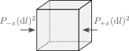
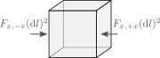

 # The equations of stellar structure and evolution

Goals:

- Derive the equation of motion
- Derive a form of the energy equation
- Derive the continuity equation
- Virial theorem
- Lane-Embden equation

## Equation of motion

We first consider the 3D problem before reducing it to radial symmetry. Start with a box with sides of size $\mathrm{d}l$ and density $\rho$.

The mass of the box is simply

$$\mathrm{d}m = \rho \mathrm{d} V = \rho(\mathrm{d}l)^3$$

If we consider the box is moving with the fluid, rather than being static in space, we can write its equation of motion as $\mathrm{d}m\cdot\vec{a}=\vec{f}$, where $\vec{a}$ is the acceleration and $\vec{f}$ are the forces acting on the box:

$$\mathrm{d}m\cdot \vec{a}=\vec{f}=\vec{f}_g + \vec{f}_P$$

where we have separated the forces into the contribution from gravity and that from the fluid pressure. The gravitational force can be expressed as the gradient of the gravitational potential, which in turn must satisfy Poisson's equation,

$$\vec{f}_g=-\mathrm{d}m\nabla\Phi,\quad \nabla^2\Phi = 4\pi G \rho.$$

To compute $\vec{f}_P$, we focus first on its component in one cartesian direction. If our box is aligned with the $x$ axis, then the force of pressure will be given by the difference in pressure between two sides, multiplied by the area of the face. This is illustrated in the figure below, where $P_{-x}$ and $P_{+x}$ is the value of the pressure at each side.

The $x$ component of the pressure force is then

$$\vec{f}_P\cdot \hat{x}=(\mathrm{d}l)^2\left(P_{-x}-P_{+x}\right)$$
$$= (\mathrm{d}l)^3 \left(\frac{\partial P}{\partial x}\right)_t,$$

where the partial derivative is taken at constant time. Repeating this in all directions we find

$$\vec{f}_P = -\mathrm{d} V\left(\left(\frac{\partial P}{\partial x}\right)_t, \left(\frac{\partial P}{\partial y}\right)_t, \left(\frac{\partial P}{\partial z}\right)_t\right)=-\mathrm{d}V \nabla P,$$

which gives us the equation of motion

$$\vec{a}=-\nabla\Phi -\frac{\nabla P}{\rho}.$$

If we consider spherical symmetry, we find that

$$\boxed{a_r = -\frac{G m(r)}{r^2}-\frac{1}{\rho}\frac{\partial P}{\partial r},}$$

where $m(r)$ is the mass contained inside the radius $r$ and we have used that in spherical symmetry $\nabla \Phi = Gm(r)/r^2$.

## Energy equation

We consider the second law of thermodynamics,

$$T\frac{\mathrm{d} s}{\mathrm{d} t}=\frac{\mathrm{d} q}{\mathrm{d} t},$$

where $s$ is the specific entropy (meaning, per unit mass) and $dq/dt$ is the head added per unit mass and per unit time. Here we are also distinguishing between a co-moving time derivative ($\mathrm{d}/\mathrm{d}t$) and a time derivative fixed in space ($\partial /\partial t$). In three dimensions these two operators are related via

$$\frac{\mathrm{d}}{\mathrm{d} t} = \frac{\partial}{\partial t} + v\cdot\nabla.$$

If we have an energy flux $\vec{F}$ going through the fluid, our mass element $\mathrm{d}m$ can have energy deposited onto it if $\vec{F}$ is not constant in space. To determine this, we apply a similar reasoning to what we did in the previous section, considering first the energy that flows through two sides of the box in the $x$ direction. The energy being deposited in each side of the box corresponds to the flux times the area, as illustrated below where $F_{x,-x}$ and $F_{x,+x}$ represent the flux at each of the faces.

The heat deposited by radiation (per unit time and mass) in the $x$ direction is then

$$\frac{\mathrm{d} q}{\mathrm{d} t}=\frac{(\mathrm{d}l)^2}{\mathrm{d}m}\left(F_{x,-x}-F_{x,+x}\right)$$
$$=-\frac{(\mathrm{d}l)^3}{\mathrm{d}m}\left(\frac{\partial F_x}{\partial x}\right)_t=-\frac{1}{\rho}\left(\frac{\partial F_x}{\partial x}\right)_t$$

Combining contributions from all directions we have

$$\frac{\mathrm{d} q}{\mathrm{d} t}=-\frac{1}{\rho}\left[\left(\frac{\partial F_x}{\partial x}\right)_t+\left(\frac{\partial F_y}{\partial y}\right)_t + \left(\frac{\partial F_z}{\partial z}\right)_t\right]=-\frac{\nabla\cdot \vec{F}}{\rho}$$
$$\rightarrow T\frac{\mathrm{d} s}{\mathrm{d} t} = -\frac{\nabla\cdot \vec{F}}{\rho}.$$

And if we consider spherical symmetry the result is

$$T\left(\frac{\partial s}{\partial t}\right)_m=-\frac{1}{\rho}\cdot\frac{1}{r^2}\left(\frac{\partial(r^2 F_r)}{\partial r}\right)_t,$$

where the comoving time derivative in 1D corresponds to taking the time derivative at a fixed mass coordinate. Generally one uses the luminosity $L=4\pi r^2 F_r$ rather than the flux, which gives us

$$T\left(\frac{\partial s}{\partial t}\right)_m=-\frac{1}{4\pi \rho r^2}\left(\frac{\partial L}{\partial r}\right)_t.$$

In practice, we don't only have heat deposited by variations in the flux, but also locally through nuclear reactions. If $\varepsilon_\mathrm{nuc}$ is the energy deposited per unit mass and time, then we have

$$\left(\frac{\partial q}{\partial t}\right)_m=-\frac{\nabla \cdot \vec{F}}{\rho}+\varepsilon_\mathrm{nuc}$$
$$\rightarrow \boxed{T\left(\frac{\partial s}{\partial t}\right)_m=-\frac{1}{4\pi \rho r^2}\left(\frac{\partial L}{\partial r}\right)_t + \varepsilon_\mathrm{nuc}}$$

## Continuity equation

The continuity equation describes how the density evolves as a function of time. To obtain this equation we can think again about our box with sides $\mathrm{d}l$, but this time we will consider the box to be static in space rather than comoving with the fluid. In this case we have that the volume $\mathrm{d}V$ of the box remains constant, but not its mass $\mathrm{d}m$. In particular,

$$\mathrm{dm}=(dl)^3\rho \rightarrow \frac{\partial \rho}{\partial t}=\frac{1}{\mathrm{dV}}\frac{\partial(\mathrm{d}m)}{\partial t}.$$

The image below shows how, during an amount of time $\mathrm{d}t$ material would flow from the two sides of the box in the x-direction.

Material coming from the $-x$ direction would fill a region of volume $(\mathrm{d}l)^2v_{x,-x}\mathrm{d}t$, from which the total mass flowing is obtained by mutiplying by the density at the face. The corresponding change in mass at each face is then

$$\mathrm{d}(\mathrm{d}m)_{-x}=(\mathrm{d}l)^2 v_{x,-x}\rho_{-x}\mathrm{d}t,$$
$$\mathrm{d}(\mathrm{d}m)_{+x}=(\mathrm{d}l)^2 v_{x,+x}\rho_{+x}\mathrm{d}t.$$

We can then proceed in the same way as we did in the previous section to compute $\partial (\mathrm{d} m)/\partial t$, which will give us

$$\boxed{\frac{\partial \rho}{\partial t}=-\nabla \cdot (\rho \vec{v})},$$

which is known as the continuity equation. If we consider spherical symmetry we find that

$$\left(\frac{\partial \rho}{\partial t}\right)_r=-\frac{1}{r^2}\frac{\partial}{\partial r}\left(r^2 \rho v_r\right).\tag{1.1}$$

Note that the time derivative is taken at fixed radius rather than at fixed mass coordinate, as we were considering how properties change at a fixed location in space rather following a comoving mass element.

## Eularian versus Lagrangian description

In practice, we often use the mass coordinate $m(r)$ as a variable instead of $r$,

$$m(r,t)=\int_0^r 4\pi r'^{2} \rho(r',t) \mathrm{d}r'\tag{1.2}$$
$$\rightarrow \left(\frac{\partial m}{\partial r}\right)_t = 4\pi r^2\rho\quad\mathrm{or}\quad\left(\frac{\partial r}{\partial m}\right)_t = \frac{1}{4\pi r^2\rho}\tag{1.3}.$$

The change of $m(r,t)$ with respect to time is given by the mass flux over a shell at fixed radius $r$,

$$\left(\frac{\partial m}{\partial t}\right)_r = -4\pi r^2 \rho v_r. \tag{1.4}$$

One can combine Equations $(1.2)$, $(1.2)$ and $(1.3)$ to obtain the equation of continuity under the assumption of radial symmetry (Equation $(1.1)$). Owing to this, Equation $(1.3)$ is normally referred to as the continuity equation in stellar astrophysics. We will generally be working under the assumption of hydrostatic equilibrium, in which case there is no difference between time derivatives at constant radius or mass coordinate. Derivatives with respect to radius and mass coordinate also are always taken at fixed time. Because of this we will drop the specification of which quantity is taken to be fixed from the partial derivatives, as they can be identified from the context.

We then have two different forms for the equations of stellar structure and evolution, which depend on whether we use $r$ or $m$ as the independent spatial variable. If $r$ is the independent variable then the equations are in "Eularian" form, while using $m$ as independent variable is the "Lagrangian" form. The equation of continuity $(1.3)$ can be used to switch between both formulations, and these are summarized in the table below (note that for the energy equation we are using a time derivative at fixed mass in both formulations).

||Eularian|Lagrangian|
|-|-|-|
|Independent variable|$m=m(r)$|$r=r(m)$|
|Continuity equation|$\displaystyle\frac{\partial m}{\partial r}=4\pi r^2\rho$|$\displaystyle{\frac{\partial r}{\partial m}}=\frac{1}{4\pi r^2 \rho}$|
|Equation of motion|$\displaystyle a_r = -\frac{Gm}{r^2} - \frac{1}{\rho}\frac{\partial P}{\partial r}$|$\displaystyle a_r = -\frac{Gm}{r^2} - 4\pi r^2\frac{\partial P}{\partial m}$|
|Energy equation|$\displaystyle T\frac{\partial s}{\partial t}=-\frac{1}{4\pi r^2 \rho}\frac{\partial L}{\partial r}+\varepsilon_\mathrm{nuc}$|$\displaystyle T\frac{\partial s}{\partial t}=-\frac{\partial L}{\partial m}+\varepsilon_\mathrm{nuc}$|

Now we can ask, can we actually solve these equations? On top of initial conditions we need boundary conditions (BCs) for each equation containing a spatial derivative (as these will result in an integration constant). Two general BCs can be set at the center of the star,

$$r(m=0)=0,\quad L(m=0)=0.$$

We need one additional boundary condition, which can be set at the surface. In regular applications one uses a definition of a photosphere, where the density and pressure are finite and most photons freely travel to infinity. For analytical purposes it is better to approximate the surface as the place where pressure vanishes,

$$P(m=M)=0,$$

where $M$ is the total mass of the star. The two conditions at the core are very general, while we will refine the one at the surface later on in the course.

We can then count the number of unkowns against the number of differential equations. We have not considered composition yet, but for each element we consider, we will have one equation describing its time derivative. Using a Lagrangian formulation we have the following unkowns:

- $r(m,t)$
- $\rho(m,t)$
- $P(m,t)$
- $s(m,t)$
- $T(m,t)$
- $L(m,t)$
- $\varepsilon_\mathrm{nuc}(m,T)$

This is a total of 7 unkown variables, with only 3 differential equations! This conundrum will be solved in the following way:

- $\rho$, $P$, $s$ and $T$: An equation of state (EOS) of the fluid will gives us two of these properties by specifying any of the other two (as well as the composition). This reduces the number of unkown properties by 2.
- $L$: This will come from our study of energy transport, which will give us an equation for $L$ in terms of all other local properties such as the temperature gradient.
- $\varepsilon_\mathrm{nuc}$: This is a microphysical property that depends on local conditions such as temperature, density, and composition. We will see how it is computed when we study nuclear reactions.

## Virial theorem

Consider the Lagrangian form of the equation of motion, in the case where gravity and the pressure gradient are perfectly balanced such that there is no acceleration. Then one obtains the equation of hydrostatic equilibrium:

$$\boxed{\frac{\partial P}{\partial m}=-\frac{Gm}{4\pi r^4}.}$$

A very useful expression, known as the virial theorem,

