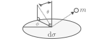
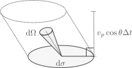

 # Degenerate equations of state

 Goals
 - Derive how $u$ and $P$ are obtained from a distribution of momenta
 - Pauli exclusion principle and degeneracy
 - Non-relativistic and extremely relativistic limits of a degenerate EOS
 - Polytropes & the Chandrasekhar mass

 ## Deriving $u$ and $P$

 We will consider a distribution of momenta, such that the number of particles with momentum between $p$ and $p+\mathrm{d}p$ in a volume $\mathrm{d}V$ is

 $$N(p,p+\mathrm{d}p)=f(p)\mathrm{d}p\mathrm{d}V.$$

 One example for $f(p)$ is the Maxwell-Boltzmann distribution,

 $$f(p)=n\frac{4\pi p^2}{(2\pi m k T)^{3/2}}\exp\left(-\frac{p^2}{2m k T}\right),$$

 which has a maximum at

 $$p_\mathrm{max}=(2m k T)^{1/2}.$$

 This distribution corresponds to the momenta of particles of mass $m$ in an ideal monoatomic gas. In the case of an ionized gas, or a gas with multiple ions of different type, each component follows the distribution with their corresponding mass and particle density. For instance, for free electrons we have

 $$n_e = \frac{\rho}{\mu_e m_u},$$

 where $m_u$ is the atomic mass unit and $\mu_e$ is the mean molecular weight per electron. The quantity $\mu_e$ can be read as the number of atomic mass units in the fluid per electron, which means that for pure ionized hydrogen $\mu_e\simeq1$, while for pure ionized helium $\mu_e\simeq2$.

 If each particle has an energy $E(p)$, then the specific internal energy of the gas is

 $$u = \frac{1}{\rho}\int_0^\infty E(p)f(p)\mathrm{d}p,\quad E(p)=mc^2\sqrt{\displaystyle 1+\frac{p^2}{m^2c^2}},$$

 as the integral gives the internal energy per unit volume, which is turned into the specific internal energy by multiplying by the specific volume $\rho^{-1}$.

 Computing pressure is a bit more complex. Consider a slab of area $\mathrm{d}\sigma$ embedded in the gas, on which particles will be bouncing,

 

 A particle with momentum $p$ colliding at an angle $\theta$ with respect to the normal will transfer momentum equal to

 $$\Delta p = 2p\cos{\theta}.\tag{3.1}$$

The pressure corresponds to a force per unit area, and a force corresponds to a change in momentum per unit time. This means that if we know the rate of collisions per unit time and direction on $\mathrm{d}\sigma$ we can integrate over all directions to get the pressure. Let's consider particles coming from a direction $\theta,\phi$, which cover a solid angle $\mathrm{d}\vec{\Omega}$ in the direction of their momenta $p$ and hit the slab $\mathrm{d}\sigma$,

 

As the distribution is isotropic, the number of particles with momenta between $p$ and $p+\mathrm{d}p$ contained in the solid angle $\mathrm{d}\vec{\Omega}$ is

$$N(p,p+\mathrm{d}p,\mathrm{d}\vec{\Omega})=\frac{f(p)}{4\pi}\mathrm{d}p\mathrm{d}V\mathrm{d}\Omega.$$

next we need to know how many particles per unit time, unit momenta and unit solid angle will cross the slab. If we consider particles with momentum $p$ hitting the slab at an angle $\theta$, and take the velocity $v_p$ for a given momentum, then in a time $\Delta t$ all particles in an area $v_p\cos\theta\mathrm{d}\sigma\Delta t$ will cross the slab.

 

The number of collisions per unit time onto the slab, with momenta between $p$ and $p+\mathrm{d}p$ coming from a solid angle $\mathrm{d}\vec{\Omega}$ is

$$r_\mathrm{coll}=\frac{f(p)}{4\pi}v_p\cos\theta\mathrm{d}\theta\mathrm{d}\sigma\mathrm{d}\rho\mathrm{d}\Omega.$$

Each of these collisions imparts a momentum $\Delta p$ given by equation $(3.1)$. The pressure is then obtained by integrating over all angles in a half sphere and dividing by $\mathrm{d}\sigma$:

$$P=\int_0^{\infty}\int_0^{2\pi}\int_0^{\pi/2} 2p\cos\theta \cdot \frac{f(p)}{4\pi}v_p\cos\theta \sin\theta \mathrm{d}\theta\mathrm{d}\phi\mathrm{d}p$$
$$P=\frac{1}{2\pi}\int_0^\infty v_p p f(p)\mathrm{d}p \int_0^{2\pi}\mathrm{d}\phi \int_0^{\pi/2}\cos^2\theta\sin\theta \mathrm{d}\theta$$
$$\boxed{P=\frac{1}{3}\int_0^\infty v_p p f(p)\mathrm{d}p,}\tag{3.2}$$

where we used $\mathrm{d}\Omega=\sin\theta\mathrm{d}\theta\mathrm{d}\phi$. We already saw in the exercises last class how this expression gives the ideal gas pressure for a Maxwell-Boltzmann distribution.

## Pauli exclusion principle and degeneracy

If we were to take a Maxwell-Boltzmann distribution and lower the temperature towards zero, all particles would tend to zero momentum. As electrons, protons and neutrons have half spin (ie. they are fermions), this cannot happen as they must satisfy the Pauli exclusion principle. If a particle has an uncertainty in momentum equal to $\mathrm{d}^3 p$ and an uncertainty in position $\mathrm{d}^3 x$ then we must have

$$\mathrm{d}^3 p\mathrm{d}^3x>h^3,$$

where $h$ is Planck's constant. Pauli's exclusion principle indicates that only two fermions can occupy a quantum cell of 6-D volume $h^3$. Gases for which their properties become affected by this quantum limit are referred to as Degenerate.

Now let's think that all particles go to their lower energy state. If we consider a volume $\mathrm{d}^3x$, then each particle will occupy a momentum space

$$\mathrm{d}^3p=\frac{h^3}{2\mathrm{d}^3 x}.$$

As they go to the lowest possible energy states, we can think they fill a sphere in momentum space up to a value $p_\mathrm{F}$, known as the Fermi momentum:

IMAGE

The volume in momentum is simply

$$\int_0^p 4\pi p^2 \mathrm{d} p = \frac{4\pi}{3}p_\mathrm{F}^3.$$

Since we know each cell occupies a 6-D space $h^2/(2\mathrm{d}^3x)$, the number of particles in $\mathrm{d}^3x$ should be:

$$N=n\mathrm{d}^3x = \frac{\left(\displaystyle \frac{4\pi}{3}p_\mathrm{F}^3\right)}{\displaystyle \left(\frac{h^3}{2\mathrm{d}^3x}\right)}=\frac{8\pi}{3h^3}p_\mathrm{F}^3 \mathrm{d}^3 x$$
$$\rightarrow n=\frac{8\pi}{3h^3}p_\mathrm{F}^3.$$

This expression allows us to compute the Fermi momentum if we know the particle density of the medium, meaning that for a given density, we know the radius in momentum space that would be occupied by particles if the sink towards the lowest energy state allowable by quantum mechanics.

So what is $f(p)$? Between momenta $p$ and $p+\mathrm{d}p$ we have a volume in momentum equal to
$$V_\mathrm{p}(p,p+\mathrm{d}p)=4\pi p^2\mathrm{d}p.$$
The number of particles in this momentum shell within the volume $\mathrm{d}^3 x$ is
$$N(p,p+\mathrm{d}p)=\frac{4\pi p^2 \mathrm{d}p}{\displaystyle\left(\frac{h^3}{2\mathrm{d}^3 x}\right)},$$
which from the definition of $f(p)$ means that
$$\boxed{f(p)=
\begin{cases}
\displaystyle \frac{8\pi}{h^3}p^2 & p<p_\mathrm{F} \\
0 & p>p_\mathrm{F}.
\end{cases}}\tag{3.3}
$$

So how does this compare to a Maxwell-Boltzmann distribution?

IMAGE

As the temperature is lowered, the expectation from a Maxwell-Boltzmann distribution violates the Pauli-exclusion principle. In practice, one has a soft transition between the Maxwell-Boltzmann distribution and the distribution of a fully degenerate gas (equation $3.3$).

## Non-relativistic and extremely relativistic regimes of a degenerate EOS

Within a mixture of ions and electrons, as density increases electrons will be the first to become degenerate (see the exercises) and dominate the gas pressure. This is the case in white dwarf interiors. Since we have

$$n_e = \frac{\rho}{\mu_e m_\mathrm{u}},$$

the Fermi momentum is

$$p_\mathrm{F}=\left(\frac{3h^3}{8\pi}\frac{\rho}{\mu_e m_\mathrm{u}}\right)^{1/3},$$

and for the case of full degeneracy, the distribution of momenta is given by equation $(3.3)$. We can then use equation $(3.2)$ to evaluate the pressure. The integral depends on the value of the velocity as a function of momentum, which can be obtained from the relationship

$$p = \frac{m_e v_p}{\sqrt{1-v_p^2/c}}.$$

The pressure integral has an analytical solution in this general case, but it is much more instructive to explore two limiting cases in which the relationship between velocity and momentum is simpler:

- Non relativistic: In this case we have the simple classical relationship
    $$\displaystyle v_p=\frac{p}{m_e}$$
- Extremely relativistic: As the electron density increases, the fermi momentum becomes larger and larger, and eventually the majority of the electrons will have $v\sim c$. The extremely relativistic limit considers the case where we take for all particles
    $$v_p = c.$$

In both cases the integral for the pressure comes out to be a simple integral over a power of $p$ (see exercises). The pressure in the two limits turns out to be a polytrope with a specific polytropic index $n$,

$$P_\mathrm{NR} = \frac{1}{20}\left(\frac{3}{\pi}\right)^{2/3}\frac{h^2}{m_e m_\mathrm{u}^{5/3}}\left(\frac{\rho}{\mu_e}\right)^{5/3}\tag{n=3/2}$$
$$P_\mathrm{ER}=\left(\frac{3}{\pi}\right)^{1/3}\frac{hc}{8m_\mathrm{u}^{4/3}}\left(\frac{\rho}{\mu_e}\right)^{4/3}\tag{n=3}.$$

Since the equations of state in these limiting cases are polytropes, we can make use of the Lane-Emden equation to describe stars that follow them!

## Polytropes and the Chandrasekhar mass

Let's recap the Lane-Emden equation. If we have a polytropic EOS

$$P=K\rho{1+1/n},$$

then a hydrostatic model satisfies the equation

$$\frac{1}{z}\frac{\mathrm{d}}{\mathrm{d}z}\left(z^2\frac{\mathrm{d}w}{\mathrm{d}z}\right) = -w^n,\quad w(0)=1,\quad w'(0)=0,$$

where

$$\rho = \rho_\mathrm{c} (w(z))^n,\quad P=P_\mathrm{c}(w(x))^{n+1}$$

and

$$r = r_nz,\quad r_n^2 = \frac{(n+1)P_\mathrm{c}}{4\pi G \rho_\mathrm{c}^2}.$$

The surface is located at the value $z_n$ where the function has its first zero.

IMAGE

As part of the exercises it was also shown that the total mass of a polytropic model is

$$M=4\pi r_n^3 \rho_\mathrm{c}\left.\left(-z^2\frac{\mathrm{d}w}{\mathrm{d}z}\right)\right|_{z=z_n},\tag{3.4}$$

and that if $K$ is fixed, we have a mass radius relationship,

$$R\propto M^\beta,\quad \beta=\frac{1-n}{3-n}.$$

let's consider first the non-relativistic case, where $n=3/2$ which gives us $\beta=-1/3$. This means that more massive degenerate stars are more compact. In turn, this also means that their Fermi momentum is higher everywhere (as it increases with density), making them more relativistic. As the mass keeps increasing, we'd expect a star to approach the extremely relativistic regime, for which $n=3$. However this would give us an undefined $\beta$, meaning the mass radius relationship is not defined. Why is this the case?

Using the definition of $r_n$ we can rewrite $(4.3)$ as

$$M=4\pi \left(\frac{(n+1)P_\mathrm{c}}{4\pi G \rho_\mathrm{c}}\right)^{3/2}\rho_\mathrm{c}A_n,$$

where $A_n$ is just a constant that depends on the polytropic index. Ignoring all constants (either fixed values from solutions to the Lane-Emden equation or fundamental constants) we find that

$$M\propto \frac{P_c^{3/2}}{\rho_c^2}=\left(\frac{P_\mathrm{c}^3}{\rho_c^4}\right)^{1/2}.$$

But in the extremely relativistic ,case $P_\mathrm{c}\propto \rho_c^{4/3}$, meaning that in this limit $M$ has a unique value which is just a function of fundamental constants! If we properly evaluate all those constants we find that this mass (known as the Chandrasekhar mass) is:

$$M_\mathrm{Ch}=\frac{5.836}{\mu_e^2}M_\odot,$$

which is equal to $1.46M_\odot$ for $\mu_e=2$, characteristing of white dwarf composition. This is a fundamental limit for the mass of a star supported by electron pressure degeneracy.
