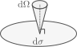
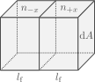

# Radiative energy transport

Goals:

- What is opacity?
- Planck's law and energy density
- Basics of diffusion
- Radiative temperature gradient

## What is opacity?

One form in which energy is transported in stellar interiors is through radiation. However, most of the star is opaque, and photons can only travel short distances before being scattered or absorbed. The "opaqueness" of stellar matter can be described by the opacity $\kappa$, which has units of

$$[\kappa]=\mathrm{cm^{2}\,g^{-1}},$$

where brackets denote the units of what is inside.

So what is opacity? Let's stars by thinking of a medium with particles of mass $m$, which interact with passing radiation. We will consider each particle acts as a disk of area $\sigma$ (its cross section), and that all radiation is absorbed when it hits a particle. We can now consider a thin slab of material as follows:

The total number of particles in the slab is

$$dN = \frac{\rho}{m}\mathrm{d}x\mathrm{d}y\mathrm{d}z,$$

which means that the probability of a photon going through the slab and crashing with a particle is

$$P_\mathrm{coll}=\frac{\sigma \mathrm{d}N}{\mathrm{d}x\mathrm{d}y}=\frac{\sigma \rho}{m}\mathrm{d}z.$$

From here we have the term

$$\left[\frac{\sigma}{m}\right]=\mathrm{cm^2\,g^{-1}},$$

which has the units of opacity. Indeed, opacity can be described as a cross section per unit mass, and for this specific example we take

$$\kappa\equiv \frac{\sigma}{m}\rightarrow P_\mathrm{coll}=\kappa\rho\mathrm{d}z.$$

Now let's see how flux changes as it goes through the slab:

 

Absent any emission from the slab itself, the difference between the fluxes at the faces is just

$$F(z)-F(z+\mathrm{d}z)=F(z)P_\mathrm{coll}=F(z)\kappa\rho\mathrm{d}z,$$

and approximating the different in flux with a partial derivative gives us a differential equation for the flux,

$$\frac{\mathrm{d}F}{\mathrm{d}z} = \kappa\rho F(z).$$

For a constant $\kappa\rho$, the solution to this differential equation corresponds to exponential decay,

$$F(z)=F(z_0)e^{-\kappa\rho(z-z_0),}$$

where $z_0$ is a reference point. From here we have two important concepts:

- The factor $\kappa\rho$ in the exponential has units
   
   $$[\kappa\rho]=\mathrm{cm}^{-1},$$

   so we can define a mean free path for photons as

   $$\displaystyle l_\mathrm{f}=\frac{1}{\kappa\rho}$$

   This corresponds to the typical distance travelled by a photon before colliding.
   
   If we also consider radiation travelling a distance $d$ through a medium, we can define a dimensionless optical depth $\tau$ as
   
   $$\tau = \frac{d}{l_\mathrm{f}}=\kappa\rho d.$$

   The optical depth then represents the number of mean free paths covered by $d$. In practice $\kappa\rho$ varies through a medium, so instead one uses

   $$d\tau = \kappa\rho \mathrm{d}z.$$

   For a star, the optical depth normally refers to the value integrated from an infinite distance all the way to its surface,

   $$\tau(r) = \int_r^\infty \kappa\rho \mathrm{d}r,$$

   and as we will see later, a usual definition of a stars surface, its photosphere, is taken to be at $\tau=2/3$.

## Planck's law

Let's consider radiation is in local thermodynamical equilibrium with the gas at a temperature $T$. Then its energy flux per unit frequency and solid angle is:

$$B_\nu (\nu,T)=\frac{2h\nu^3}{c^2}\frac{1}{\displaystyle \exp\left(\frac{h\nu}{k_\mathrm{B}T}\right)-1}.$$

What does this imply for the distribution of momenta? Remember that we defined the distribution $f(p)$ in terms of the number of particles per unit volume and unit momentum.

We take an area element $\mathrm{d}A$, and photons crossing it with a momentum covering a solid angle $\mathrm{d}\Omega$ around the perpendicular direction,

In a time $\mathrm{d}t$, the number of photons crossing $\mathrm{d}A$ with directions contained in $\mathrm{d}\Omega$ is

$$\mathrm{d}N=f(p)c\mathrm{d}t\mathrm{d}A\frac{\mathrm{d}\Omega}{4\pi}\mathrm{d}p,\tag{4.1}$$

where we used the velocity of the photons being the speed of light $c$ and took an isotropic $f(p)$.

Each individual photon carries an energy $h\nu$, so the energy corresponding to $\mathrm{d}N$ is

$$\mathrm{d}E=h\nu \mathrm{d}N.\tag{4.2}$$

Similarly, the momentum of each photon is

$$p=\frac{h\nu}{c}\rightarrow \mathrm{d}p=\frac{h}{c}\mathrm{d}\nu.\tag{4.3}$$

Combining equations $(4.1)$, $(4.2)$ and $(4.3)$ we find that

$$\frac{\mathrm{d}E}{h\nu}=f(p)c\mathrm{d}t\mathrm{d}A\frac{\mathrm{d}\Omega}{4\pi}\frac{h\mathrm{d}\nu}{c}$$
$$\rightarrow \frac{\mathrm{d}E}{\mathrm{d}t\mathrm{d}A\mathrm{d}\Omega\mathrm{d}\nu}=B_\nu = \frac{h^2 \nu}{4\pi}f(p).$$

We can also define the distribution per unit frequency,

$$f(p)\mathrm{d}p=f(\nu)\mathrm{d}\nu \rightarrow \boxed{f(\nu)=\frac{4\pi}{hc\nu}B_\nu.}\tag{4.4}$$

We can use the same expressions as last class to describe the contribution of radiation to energy density. Expressing the energy density per unit frequency and unit volume we have

$$U_\nu = f(\nu)h\nu = \frac{4\pi}{c}B_\nu.$$

Similarly, we can describe the flux crossing in one direction of a surface,

$$F=\int_0^{2\pi}\int_0^{\pi/2}\int_0^\infty \cos\theta\sin\theta B_\nu \mathrm{d}\nu \mathrm{d}\theta \mathrm{d}\phi,$$

which has an analytical solution,

$$F=\sigma T^4,\quad \sigma=\frac{2\pi^5 k_B^4}{15h^3c^2}.$$

The constant $\sigma$ is known as the Stefan-Boltzmann constant. Pressure can be found to be equal to

$$P_\mathrm{rad}=\frac{a}{3}T^4,\quad a=\frac{4\sigma}{c},$$

where $a$ is known as the radiation constant.

Finally, the total energy density (per unit volume) is

$$U=aT^4. \tag{4.5}$$

## Basics of diffusion

If we consider a medium with a density of a particular quantity $U$ (per unit volume), moving with a velocity $v$ and a mean free path $l_\mathrm{f}$, then the flux of that property is

$$\vec{F}=-D\nabla U,\quad D=\frac{vl_\mathrm{f}}{3},\tag{4.6}$$

where we have defined the diffusion coefficient $D$ which has units

$$[D]=\mathrm{cm^{2}\;s^{-1}}.$$

In practice we have multiple velocities and mean free paths, so one would generally use an average $\langle vl_\mathrm{f} \rangle $.

The flux described by equation $(4.6)$ needs not just be energy, it can also describe a flux of particles of different types. Now, we will not formally derive (4.6), but we will provide a 1-D analogue. Consider motion only happens in the $+x$ or $-x$ direction. We then take an are $\mathrm{d}A$ separating two regions of length equal to $l_\mathrm{f}$,

We approximate the particle density at each side as $n_{-x}$ and $n_{+x}$ with

$$\frac{\mathrm{d}n}{\mathrm{d}x} = \frac{n_{+x}-n_{-x}}{l_\mathrm{f}}.$$

Each box contains a certain amount of particles,

$$\mathrm{d}N_{-x}=\frac{n_{+x}-n_{-x}}{l_\mathrm{f}}.$$

If we take all particles to move with a velocity $v$ in either the $+x$ or $-x$ direction (with equal probability), then in a time $l_\mathrm{f}/v$ half of the particles from each box will cross the interface, resulting in a flux

$$F_x=\frac{(\mathrm{d}N_{-x}-\mathrm{d}N_{+x})/2}{\mathrm{d}A}\frac{v}{l_\mathrm{f}}$$
$$F_x = -\frac{vl_\mathrm{f}}{2}\frac{\mathrm{d}n}{\mathrm{d}x}.$$

Comparing to equation $(4.6)$, the diffusion coefficient has an incorrect prefactor, as we have ignored the actual isotropic direction of the velocities, as well as that particles coming from larger distances originated from regions of different densities.

## Radiative temperature gradient

Now let us consider the flux coming from photon diffusion. For now we ignore frequency dependency and take all photons to have the same $l_\mathrm{f}$,

$$l_\mathrm{f}=\frac{1}{\kappa\rho}.$$

Assuming radial symmetry, equations $(4.5)$ and $(4.6)$ give

$$F_r = \left.-\frac{c}{3\kappa\rho}\frac{\partial U}{\partial r} = -\frac{4acT^3}{3\kappa\rho}\frac{\partial T}{\partial r}\quad\right/4\pi r^2\cdot$$
$$L = -\frac{16 \pi r^2 acT^3}{3\kappa\rho}\frac{\partial T}{\partial r}$$
$$\rightarrow \boxed{\frac{\partial T}{\partial r}=-\frac{3\kappa \rho L}{16\pi r^2 a c t^3}}.\tag{4.8}$$

Whenever energy transport happens through radiation, this equation describes the temperature gradient required. In cases where other mechanisms transport energy, equation (4.8) describes the radiative luminosity $L_\mathrm{rad}$ rather than the total one.

One generally transforms equation (4.8) into a pressure derivative by using the equation of hydrostatic equilibrium,

$$\frac{\partial P}{\partial r} = -\rho\frac{Gm}{r^2},$$

from which we get

$$\left.\frac{\partial T}{\partial P}=\frac{\partial T}{\partial r}\left(-\frac{r^2}{\rho G m}\right) = \frac{3\kappa L}{16\pi ac G T^3 m}\quad\right/ \frac{P}{T}\cdot$$
$$\boxed{\nabla_\mathrm{rad}\equiv\frac{\partial \ln T}{\partial \ln P}=\frac{3}{16\pi a c G}\frac{\kappa L P}{m T^4}}\tag{4.9}.$$

The quantity $\nabla_\mathrm{rad}$ will be particularly important in our discussion of convection in the next class.

In reality we need to consider that opacity is a function of frequency. In that case we use instead $(4.4)$ and $(4.6)$ to describe the flux per unit frequency,

$$\vec{F}=-D_\nu \nabla U_\nu,\quad D_\nu = \frac{c}{3\kappa_\nu \rho}.$$

The resulting radial flux per unit frequency can be integrated over frequency to obtain

$$\nabla_\mathrm{rad}=\frac{3}{16\pi a c G}\frac{\kappa_\mathrm{R} L P}{m T^4},$$

where $\kappa_\mathrm{R}$ is the Rosseland mean opacity

$$\frac{1}{\kappa_\mathrm{R}}\equiv \frac{\pi}{acT^3}\int_0^\infty\frac{1}{\kappa_\nu}\frac{\partial B_\nu}{\partial T}\mathrm{d}\nu$$

## Conduction

We can also consider conduction in Equation $(4.7)$. The flux can be taken to be proportional to the temperature gradient, with
two contributions given by conduction coefficients for radiative
energy transport and one for actual particle conduction:

$$\vec{F}=(k_\mathrm{rad}+k_\mathrm{cd})\nabla T,$$

where

$$k_\mathrm{rad}=\frac{4ac}{3}\frac{T^3}{\kappa_\mathrm{rad}\rho}.$$

The conduction coefficient $\kappa_\mathrm{cd}$ is determined by the energy density of the particles, their velocity, and their internal energy density,

$$k_\mathrm{cd}=\frac{lv}{3}\frac{\partial U}{\partial T}.$$

It is common to define a conductive opacity $\kappa_\mathrm{cd}$ as

$$k_\mathrm{cd}=\frac{4ac}{3}\frac{T^3}{\kappa_\mathrm{cd}\rho},$$

From which we can use the same expression for the temperature gradient $(4.9)$ but with the opacity replaced with

$$\frac{1}{\kappa}=\frac{1}{\kappa_\mathrm{R}}+\frac{1}{\kappa_\mathrm{cd}}.$$

In this sense the lowest opacity, indicating more transparency, dominates.