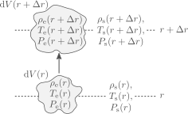

# Convection

Goals:

- Schwarzschild criterion
- Brunt-Väisälä frequency
- Mixing length theory

## Scharzschild criterion

So far we have considered two processes to transport energy, conduction and radiation. If we were to consider higher and higher luminosities, while fixing the temperature, density and radius, we would need increasingly steeper temperature gradients (see equation $(4.8)$). But, as we will see now, dynamical instabilities arise if the temperature gradient becomes too steep.

Let's consider a mass element that is radially displaced upwards a distance $\Delta r$.

Here we differentiate between properties of the mass element with the subscript "e" and those of its surroundings with a subscript "s". Before the perturbation, we take the properties of the element and its surroundings to be equal,

$$\rho_\mathrm{e}(r)=\rho_\mathrm{s}(r),\quad T_\mathrm{e}(r)=T_\mathrm{s}(r),\quad P_\mathrm{e}(r)-P_\mathrm{s}(r).$$

We will also consider that the displacement happens slowly, such that sound waves quickly equalize the pressure of the mass element with its surroundings as it rises,

$$P_\mathrm{e}(r+\Delta r) = P_\mathrm{s}(r+\Delta r).$$

This requires that the velocity of the moving element is much slower than the local sound speed.

We can now consider the stability of the displaced element. Let's define the following quantities:

$$D\rho(r)=\rho_\mathrm{e}(r)-\rho_\mathrm{s}(r), \quad DT(r)=T_\mathrm{e}(r)-T_\mathrm{s}(r).$$

After being displaced a distance $\Delta r$, the mass element will experience a radial buoyancy force

$$F_\mathrm{r}=-g D\rho(r+\Delta r)\mathrm{d}V(r),$$

where $g=Gm(r)/r^2$ is the local gravity. Given this, if for an upwards displacement (positive $\Delta r$) the density of the mass element becomes smaller than that of its surroundings, there will be a net outwards force and the system will be unstable. For a small $\Delta r$ we can write

$$F_\mathrm{r}=-g\left[\left(\frac{\mathrm{d}\rho}{\mathrm{d}r}\right)_\mathrm{e}-\left(\frac{\mathrm{d}\rho}{\mathrm{d}r}\right)_\mathrm{s}\right]\Delta r \mathrm{d}V(r+\Delta r),\tag{5.1}$$

and requiring $F_\mathrm{r}<0$ for $\Delta r>0$ we obtain a stability criterion:

$$\left(\frac{\mathrm{d}\rho}{\mathrm{d}r}\right)_\mathrm{e}-\left(\frac{\mathrm{d}\rho}{\mathrm{d}r}\right)_\mathrm{s}>0.\tag{5.2}$$

The same result is obtained if we take a perturbation with $\Delta r=0.$

In practice, we use a different version of the instability criterion that depends on the temperature gradient. Let's consider the relationship between changes in density, temperature and pressure (ignoring composition variation for simplicity):

$$\frac{\mathrm{d}\rho}{\rho}=\alpha\frac{\mathrm{d}P}{P}-\delta\frac{\mathrm{d}T}{T},$$

where

$$\alpha=\left(\frac{\partial \rho}{\partial P}\right)_T,\quad \delta=-\left(\frac{\partial \rho}{\partial T}\right)_P.$$

Using this the left hand side of equation $(5.2)$ can be rewritten as

$$\left(\frac{\mathrm{d}\rho}{\mathrm{d}r}\right)_\mathrm{e}-\left(\frac{\mathrm{d}\rho}{\mathrm{d}r}\right)_\mathrm{s}=\cancel{\frac{\alpha\rho}{P}\left(\frac{\mathrm{d}P}{\mathrm{d}r}\right)_\mathrm{e}} - \frac{\delta\rho}{T}\left(\frac{\mathrm{d}T}{\mathrm{d}r}\right)_\mathrm{e} - \cancel{\frac{\alpha\rho}{P}\left(\frac{\mathrm{d}P}{\mathrm{d}r}\right)_\mathrm{s}} + \frac{\delta\rho}{T}\left(\frac{\mathrm{d}T}{\mathrm{d}r}\right)_\mathrm{s},\tag{5.3}$$

where the pressure derivatives cancel from our assumption of a slowly rising element.

Consider now the pressure scale height, defined as

$$H_P\equiv -P\left(\frac{\mathrm{d}P}{\mathrm{d}r}\right)^{-1}.$$

The pressure scale height serves as a measure of the length scale over which the stellar interior changes. In the case of hydrostatic equilibrium we have

$$H_P = \frac{P}{\rho g}.$$

Multiplying $(5.3)$ by $H_P$ can be used to turn the radial derivatives into pressure derivatives,

$$H_P\left[\left(\frac{\mathrm{d}\rho}{\mathrm{d}r}\right)_\mathrm{e}-\left(\frac{\mathrm{d}\rho}{\mathrm{d}r}\right)_\mathrm{s}\right]=\frac{\delta \rho P}{T}\left[\left(\frac{\mathrm{d}T}{\mathrm{d}P}\right)_\mathrm{e}-\left(\frac{\mathrm{d}T}{\mathrm{d}P}\right)_\mathrm{s}\right]$$
$$=\delta\rho\left[\left(\frac{\mathrm{d}\ln T}{\mathrm{d}\ln P}\right)_\mathrm{e} - \left(\frac{\mathrm{d}\ln T}{\mathrm{d}\ln P}\right)_\mathrm{s}\right].\tag{5.4}$$

The temperature gradient with respect to pressure in the surroundings of the mass element is the definition of $\nabla$,

$$\nabla\equiv\left(\frac{\mathrm{d}\ln T}{\mathrm{d}\ln P}\right)_\mathrm{s}.$$

In contrast to $\nabla_\mathrm{rad}$, this is the actual temperature gradient of the star, while $\nabla_\mathrm{rad}$ represents the gradient required for all the luminosity to be transported by radiation (or also, conduction). If we consider the mass element is displaced adiabatically,

$$\left(\frac{\mathrm{d}\ln T}{\mathrm{d}\ln P}\right)_\mathrm{e}=\nabla_\mathrm{ad},$$

and equation $(5.4)$ is

$$\left(\frac{\mathrm{d}\rho}{\mathrm{d}r}\right)_\mathrm{e}-\left(\frac{\mathrm{d}\rho}{\mathrm{d}r}\right)_\mathrm{s} = \frac{\delta\rho}{H_P}(\nabla_\mathrm{ad}-\nabla),\tag{5.5}$$

and the stability condition of equation $(5.1)$ reduces to

$$\boxed{\nabla_\mathrm{ad}>\nabla.}$$

This is known as the Schwarzschild criterion.

## Brunt-Väisälä frequency

Before discussing what happens if the fluid is unstable to convection, let's see how a perturbation evolves with time. Combining $(5.1)$ and $(5.5)$ we get the equation of motion

$$\mathrm{d}m\frac{\mathrm{d}^2\Delta r}{\mathrm{d}t^2}=-\frac{g\delta\rho}{H_P}(\nabla_\mathrm{ad}-\nabla)\Delta r \mathrm{d}V(r+\Delta r)\tag{5.6}.$$

For the volume $\mathrm{d}V$ we have

$$\mathrm{d}V(r+\Delta r)=\frac{\mathrm{d}m}{\rho(r+\Delta r)}=\frac{\mathrm{d}m}{\displaystyle\rho(r)+\Delta r\left(\frac{\mathrm{d}\rho}{\mathrm{d}r}\right)_\mathrm{e}}\simeq \frac{\mathrm{d}m}{\rho(r)}\left[1-\frac{\Delta r}{\rho}\left(\frac{\mathrm{d}\rho}{\mathrm{d}r}\right)_\mathrm{e}\right],$$

so to first order in $\Delta r$ equation $(5.6)$ is

$$\frac{\mathrm{d}^2\Delta r}{\mathrm{d}t^2}=-\frac{g\delta}{H_P}(\nabla_\mathrm{ad}-\nabla)\Delta r.\tag{5.7}$$

The solution to this equation consists of oscillatory behavior or exponential growth, depending on the sign of $\nabla_\mathrm{ad}-\nabla$,

$$\Delta r = (\Delta r)_0 \exp(i\omega_\mathrm{BV}(t-t_0)),$$

where $\omega_\mathrm{BV}$ is the Brunt-Väisälä frequency

$$\omega_\mathrm{BV}^2 = \frac{g\delta}{H_P}\left(\nabla_\mathrm{ad}-\nabla\right).$$

In regions of a star where $\nabla_\mathrm{ad}>\nabla$ (meaning, convectively stable) $\omega_\mathrm{BV}$ defines a natural frequency of oscillations within the star.

Note that in our discussion on stability we have not considered the effect of possible composition gradients, which can develop naturally inside a star as a consequence of nuclear burning. How that affects the instability criterion (and thus, the Brunt-Väisälä frequency) is studied in the exercises of this session.

## Mixing length theory

So, what happens if the fluid is unstable to convection? Then we will have energy transported through advection. If we consider a mass element travels a distance $l$ before dissolving and equalizing its temperature with its environment, then it will release an amount of heat

$$Q = \mathrm{d}m c_P DT(r+l).\tag{5.8}$$

As convection requires $\nabla_\mathrm{ad}<\nabla$, and pressure decreases outwards, we expect $DT(r+l)$ to be positive for positive $l$ and negative otherwise. This implies that convection indeed transports energy outwards.

But how much energy flux do we expect? In principle this is a very complex 3D hydrodynamics problem, which is unfeasible to compute together with the long evolutionary timescales of stars. Instead, the most common approach is a 1D approximation known as mixing length theory (MLT). Here we will show an example of MLT which does not account for radiative losses of energy from a mass element as it is displaced.

As small perturbations induce instability, let's assume that a convective region is entirely composed of blobs of materials that are unstable and move up or down. We consider a slab of material of area $\mathrm{d}A$, and consider the mass elements crossing it in a time $\mathrm{d}t$,

These elements have different velocities, sizes and temperature contrasts $DT$. We simplify things by taking all elements to have a characteristic absolute velocity $|v|$ and absolute temperature contrast $|DT|$ (positive for rising elements, negative otherwise). The amount of mass crossing $\mathrm{d}A$ upwards in time $\mathrm{d}t$ is

$$\mathrm{d}M_+=\frac{1}{2}\rho|v|\mathrm{d}A\mathrm{d}t,$$

and similarly the mass crossing downwards is

$$\mathrm{d}M_-=\frac{1}{2}\rho|v|\mathrm{d}A\mathrm{d}t=\mathrm{d}M_+.$$

The total energy flux can be estimated by considering the heat excess given by equation $(5.8)$. As $v$ and $DT$ are positive for elements moving radially upwards, they produce a net outwards radial energy flow. The same applies to downwards moving elements, which have a negative $v$ and negative $DT$.

Dropping the absolute values to simplify notation and taking $v$ and $DT$ as positive, the flux coming from upwards and downwards moving mass elements totals

$$F=\rho v c_P DT.\tag{5.9}$$

We will take as a characteristic length traveled by the mass element at the moment it crosses $\mathrm{d}A$ to be half of their total travel distance $l_\mathrm{MLT}$. The distance $l_\mathrm{MLT}$ is a-priori unknown, and it is the reason for the name "mixing-length-theory". For a displacement $l_\mathrm{MLT}/2$ we have for $DT$

$$DT=\frac{l_\mathrm{MLT}}{2}\left.\left[\left(\frac{\mathrm{d}T}{\mathrm{d}r}\right)_\mathrm{e}-\left(\frac{\mathrm{d}T}{\mathrm{d}r}\right)_\mathrm{s}\right]\quad\right/\cdot H_P$$

$$H_P DT = -\frac{Pl_\mathrm{MLT}}{2}\left[\left(\frac{\mathrm{d}T}{\mathrm{d}P}\right)_\mathrm{e}-\left(\frac{\mathrm{d}T}{\mathrm{d}P}\right)_\mathrm{s}\right]$$

$$DT=-\frac{l_\mathrm{MLT}T}{2H_P}\left[\left(\frac{\mathrm{d}\ln T}{\mathrm{d}\ln P}\right)_\mathrm{e}-\left(\frac{\mathrm{d}\ln T}{\mathrm{d}\ln P}\right)_\mathrm{s}\right]$$

$$DT = -\frac{l_\mathrm{MLT}T}{2H_P}(\nabla-\nabla_\mathrm{ad}),\tag{5.10}$$

which as we have mentioned is positive for a positive $l_\mathrm{MLT}$ in a convective region, as the Schwarzschild criterion requires $\nabla>\nabla_\mathrm{ad}$. The quantity $(\nabla-\nabla_\mathrm{ad})$ is known as the superadiabaticity.

We then need to compute the characteristic velocity $v$. Using equation $(5.7)$ we can estimate the work done on the fluid element after it has traveled a distance $l_\mathrm{MLT}/2$,

$$W=\int_0^{l_\mathrm{MLT}/2}\mathrm{d}m\frac{g\delta}{H_P}(\nabla-\nabla_\mathrm{ad})\Delta r\mathrm{d}(\Delta r)$$
$$= \mathrm{d}m\frac{g\delta}{H_P}(\nabla-\nabla_\mathrm{ad})\frac{l_\mathrm{MLT}^2}{4}.$$

Not all of this work is translated into kinetic energy, as the gas also does work by expanding as it rises, pushing matter around. It is in details such as those that different forms of MLT arise. To recover a standard form of the convective flux, we will assume a quarter of $W$ goes into kinetic energy,

$$\frac{1}{2}\mathrm{d}m v^2 = \frac{W}{4}$$

$$\rightarrow v=\left(\frac{g\delta}{H_P}\right)^{1/2}(\nabla-\nabla_\mathrm{ad})^{1/2}\frac{l_\mathrm{MLT}}{2\sqrt{2}}.$$

From this expression for the convective velocity we get the convective flux using equations $(5.9)$ and $(5.10)$,

$$\boxed{F_\mathrm{conv}=\rho c_P T \sqrt{g\delta} \frac{l_\mathrm{MLT}^2}{4\sqrt{2}}H_P^{-3/2}(\nabla-\nabla_\mathrm{ad})^{3/2}.}$$

From this equation we see that the larger the superadiabaticity, the larger the convective flux. In many situations we find that the prefactor to $(\nabla-\nabla_\mathrm{ad})^{3/2}$ in $F_\mathrm{conv}$ is so large that in practice the star only needs a small superadiabaticity $(\nabla-\nabla_\mathrm{ad})\ll 1$ to transport its energy outwards. In that case a coarse approximation of a structure equation for a convective region is to have

$$\nabla = \nabla_\mathrm{ad}.$$

This is however not generally applicable, as radiative losses can make convection inefficient particularly in the outermost layers of a star.