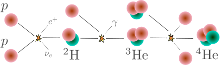

# Nucleosynthesis

Goals:

- Basic definitions
- Cross sections and rates
- Tunneling and the Gamow peak
- Nuclear burning stages

For reference, this section is based on chapter 6 of the lectures on stellar evolution by Onno Pols, available at [https://www.astro.ru.nl/~onnop/education/stev_utrecht_notes/](https://www.astro.ru.nl/~onnop/education/stev_utrecht_notes/).

## Basic definitions

We have by now discussed how energy is transported through a star, but have not considered in much detail how it is generated. A natural source of energy is contraction, where a star sinks into its own potential well to provide its surface luminosity. However, through most of a stars lifetime the main source of energy comes from nuclear fusion reactions.

Typical notations for reactions are

$$X+a\rightarrow Y+b\quad \text{or} \quad X(a,b)Y.$$

In here it could be read that $X$ produces $Y$ by interacting with $a$, releasing $b$ as a side product. But in practice $X$ and $a$ have equivalent roles in the reaction. Any such reaction must satisfy two basic conservation laws

- Conservation of baryon number
- Conservation of charge

The first conservation law can be taken as that the sum of protons and neutrons must remain constant.

The reason why nuclear reactions allow for a release of energy is that due to nuclear forces the rest mass energy of an atomic nucleus is different from that of its constituent neutrons and protons if they were free particles. Considering the actual mass $m_i$ of a nucleus with atomic number $A_i$, its binding energy is defined as

$$E_{\mathrm{b},i}=[(A_i-Z_i)m_n + Z_i m_p - m_i]c^2.$$

If we consider the most common isotopes for each element, one can see how the energy per baryon varies with mass number (image source: [Wikimedia Commons](https://commons.wikimedia.org/wiki/File:Binding_energy_curve_-_common_isotopes.svg)),

We see that the most bound nucleus is $^{56}\mathrm{Fe}$. This means that by fusing lighter atoms we can release energy (exothermic reactions), but once we burn everything into iron any additional fusion process requires energy (endothermic reaction). The formation of an iron core then represents a critical evolutionary stage, as we will see later.

The energy released by a reaction rate can be determined by taking the mass difference between the initial and final states,

$$Q=(m_X+m_a-M_Y-m_b)c^2.\tag{6.1}$$

In some cases some of this energy is, however, lost. This is the case when neutrinos are produced, which can have large energies and can travel pretty much unimpeded from the stellar core to its surface.

In order to compute (6.1), one can make use of atomic masses. However, note that these are for neutral atoms, so they include electron masses!

## Cross sections & rates

Just as wit the interaction of light and matter, nuclear reactions are characterized by cross sections. If we consider fixed particles $X$ against which a flux (particles per unit area) of particles $a$ is shot, then the cross section for the reaction is defined as

$$\sigma = \frac{\text{\# of reactions $X(a,b)Y$ per unit time per \# of $X$ particles}}{\text{flux of $a$ in frame of $X$}}.$$

If the relative velocity between particles $X$ and $a$ is $v$, then the flux of $a$ in the frame of $X$ is simply $n_av$ (where $n_a$ are the number of $a$ particles per unit volume). For arbitrary particles $i$ and $j$ we can then write the number of reactions per unit time and unit volume as

$$\tilde{r}_{ij}=n_i n_j v \sigma.$$

There is a small caveat for the case of equal particles reacting together. In that case, if we have $N$ particles the total number of pairings without double counting is

$$\frac{1}{2}N(N-1)\sim \frac{N^2}{2}\quad(\text{for $N\gg 1$}),$$

so the general form of the reaction rate is

$$\tilde{r}_{i,j}=\frac{1}{1+\delta_{ij}}n_in_jv\sigma$$

where $\delta_{ij}$ is the Kronecker delta.

In practice, inside a star we have a distribution of relative velocities between particles, and the cross section is different at different velocities. The rate then comes from integrating over all relative velocities,

$$r_{ij}=\frac{1}{1+\delta_{ij}}n_in_j\underbrace{\int_0^\infty f(v)\sigma(v)v\mathrm{d}v}_{\equiv \langle\sigma v\rangle}.\tag{6.2}$$

Here $f(v)$ has a different meaning to previous sections where we used $f$ to denote the number density of particles per unit something. Here $f$ is the distribution of relative velocities, which is a normalized property:

$$\int_o^\infty f(v)\mathrm{d}v=1.$$

Luckily for us, if both types of particles have a Maxwellian distribution then $f(v)$ also has a Maxwellian form,

$$f(v)=4\pi v^2\left(\frac{m}{2\pi k_\mathrm{B}}\right)^{3/2}\exp\left(-\frac{mv^2}{2k_\mathrm{B}T}\right),\quad m=\frac{m_im_j}{m_i+m_j}.$$

Changing integration variable in $(6.2)$ from velocity to energy (non-relavistic, so $E=mv^2/2$) one has

$$\langle\sigma v\rangle=\left(\frac{8}{\pi m}\right)^{1/2}(k_\mathrm{B}T)^{-3/2}\int_0^\infty \sigma(E)E\exp\left(-\frac{E}{k_\mathrm{B}T}\right)\mathrm{d}E.\tag{6.3}$$

The whole dependence of the nuclear reaction rate on temperature is then condensed in this factor.

For the purpose of solving the equations of stellar structure and evolution we need to know the specific nuclear energy generation rate $\varepsilon_\mathrm{nuc}$. For a reaction rate with a $Q$-value $Q_{ij}$ and rate per unit volume $r_{ij}$, one has

$$\varepsilon_\mathrm{nuc}=\frac{Q_{ij}r_{ij}}{\rho},$$

where in practice one adds up over all possible reactions.

## Tunneling & the Gamow peak

For two nuclei with atomic numbers $Z_1$ and $Z_2$, their interaction is described by a potential that is dominated by nuclear forces at very small separations and by the Coulomb potential farther away.

If we consider the core of the Sun, which has a temperature of order $10^7$ Kelvin, the typical particle energy is $\sim k_\mathrm{B}T\sim \mathrm{keV}$. In a classical picture, we need $\mathrm{MeV}$ energies to go above the Coulomb potential and produce a nuclear reaction. One could think it is still possible considering the high energy tail of a Maxwell-Boltzmann distribution, but the probability of having even a single particle with enough energy is vanishingly small.

So, we need quantum mechanics to explain how nuclear reactions can happen at all in the solar core. A particle with momentum $p$ has a corresponding wavelength that characterizes it, called the *de Broglie* wavelength:

$$\lambda = \frac{\hbar}{p},\text{ normally $\gg A^{1/3}\,\mathrm{fm}$}.$$

This allows for quantum tunneling to produce nuclear reactions even if the energy is too low to overcome the Coulomb barrier. Formally computing the cross section while accounting for this shows that the cross section is

$$\sigma(E)\sim \pi \lambda^2\underbrace{\exp(-b E^{-1/2})}_\text{Tunneling factor},$$

where

$$b=2\pi \frac{Z_i Z_j e^2}{\hbar}\left(\frac{m}{2}\right)^{1/2}=31.29 Z_iZ_j A^{1/2}\,[\mathrm{keV}^{1/2}].$$

Here $A\equiv A_iA_j/(A_i+A_j)$ is the reduced mass number. The factor $b$ ensures that different burning stages are well separated in temperature as tunneling of particles with a smaller $Z$ is significantly favored.

Since $p^2/(2m)=E$, one usually writes

$$\sigma(E)=S(E)\frac{\exp\left(-bE^{-1/2}\right)}{E},\tag{6.4}$$

where $S(E)$, called the S-factor, quantifies variations over the regular expected behavior. Often $S(E)$ varies very slowly compared to $\sigma(E)$, allowing, for example, to extrapolate cross sections determined in the laboratory to energies relevant to stellar interiors. The S-factor can, however, have strong variations due to particular resonances at specific interaction energies.

If we apply equation $(6.4)$ to equation $(6.3)$, we find that

$$\langle\sigma v\rangle = f(T,m)\int_0^\infty S(E)\exp\left(-bE^{-1/2}-\frac{E}{k_\mathrm{B}T}\right)\mathrm{d}E.\tag{6.5}$$

Excluding the S-factor, the exponential term in the integral is such that it peaks at a narrow range of energies, as depicted below.

This figure shows the value of the exponential term in equation $(6.5)$ (normalized by its maximum) for different values of the ratio $b/\sqrt{k_\mathrm{B}T}$. These values are chosen to be representative of hydrogen burning at a temperature of $10^7\,\mathrm{K}$, helium burning at $10^8\,\mathrm{K}$ and carbon burning at $5\times 10^{8}\,\mathrm{K}$. This function is commonly referred to as the Gamow peak, and can to first order be approximated with a Gaussian function. In that case, if one assumes $S(E)$ does not vary significantly within the range of energies relevant to the Gamow peak, it can be taken off the integral in equation (6.5), which can then be evaluated analytically (see exercises for this session). 

## Nuclear burning stages

### Main sequence

As under specific conditions tunneling is favored for the particles with lower $Z$, the first (and longer-lasting) phase of nuclear burning of a star is that of core-hydrogen burning, were hydrogen is fused into helium. This stage is known as the main-sequence, and the onset of core-hydrogen burning is known as the zero-age main sequence. As a hydrogen atom is composed of a single baryon, while helium consists of 4, we need a series of reactions to build it up. The identification of the specific set of reactions that are dominant in stellar evolution led to the discovery of two different burning processes. The first one is the PP-chain, which in its simpler form (called the PP-I chain), is what one might think as the most natural way to fuse four hydrogen atoms into helium. This is depicted in the figure below.

However, it is found that for stars with masses above $\sim 1.5M_\odot$, a different and much less intuitive process is dominant, known as the CNO cycle. The CNO cycle uses carbon, nitrogen and oxygen as catalysts, where through a series of hydrogen fusion processes with the CNO elements and beta decays helium can be produced without modifying the total number of CNO atoms. The figure below illustrates the CNO-I (left loop) and CNO-II (right loop) cycles.

Based on the Gamow peak, nuclear energy production rates can be approximated around a specific temperature in terms of a power-law index $\nu$ (see exercises for this session):

$$\varepsilon_\mathrm{nuc}=\varepsilon_0 \rho T^\nu.$$

For main-sequence stars it is found that for PP burning one has $\nu\simeq4$, while for CNO burning $\nu\simeq 18$. The scaling of nuclear reactions is incredibly sensitive to temperature!

### Beyond the main sequence

After a star depletes its central hydrogen, depending on conditions we'll discuss next chapter, it will start burning heavier elements. In particular, lower mass stars can undergo only a subset of the reactions discussed below. The outcome of the main-sequence is to produce a helium core, at which point the core will lose its energy source and start contracting. This leads to shell burning of hydrogen and potentially the ignition of helium in its core. This process is repeated after core helium exhaustion, resulting on shell helium burning and potentially the ignition of nuclear fusion involving heavier nuclei at its core. Below we indicate the main processes operating after the main-sequence, and the characteristic central temperatures $T_\mathrm{c}$ at which they operate.

- Helium burning, $T_\mathrm{c}>10^8\,\mathrm{K}$.
  
  The main reaction during this stage is known as the triple-$\alpha$ reaction, where three helium atoms ($\alpha$ particles) are fused into carbon. The first stage consists on the production of an unstable beryllium atom,

  $$^4\mathrm{He}+^4\mathrm{He}\leftrightarrow ^8\mathrm{Be}.$$

  The half-life of $^8\mathrm{Be}$ is very short, on the order of $10^{-16}$ seconds, so the beryllium nucleus needs to rapidly fuse with another alpha particle before decaying. The most likely process involves the production of an excited state of carbon, denoted as $^{12}\mathrm{C}^*$, which rapidly decays into the ground state of the carbon nucleus,

  $$^8\mathrm{Be}+^4\mathrm{He}\leftrightarrow ^{12}\mathrm{C}^*\rightarrow ^{12}\mathrm{C}+\gamma.$$

  The full triple-$\alpha$ process can then be summarized as

  $$3\,{^4}\mathrm{He}\rightarrow ^{12}\mathrm{C}+\gamma.$$

  Towards the end of helium burning, as the core temperature increases during this phase, $\alpha$ captures on the carbon nucleus also become important,

  $$^{12}\mathrm{C}+^{4}\mathrm{He}\rightarrow ^{16}\mathrm{O}+\gamma,$$

  such that the end result of core-helium burning is the production of a carbon-oxygen core. The $^{12}\mathrm{C}(\alpha,\gamma)^{16}\mathrm{O}$ reaction has important uncertainties at the conditions relevant in stellar interiors, which affects the resulting ratio of carbon and oxygen at the end of helium burning.

- Carbon burning, $T_\mathrm{c}>5\times 10^8\,\mathrm{K}.$

  Carbon burning proceeds through the fusion of two carbon nuclei into an excited state of magnesium, which then decays into either neon or sodium:

  $$^{12}\mathrm{C}+^{12}\mathrm{C}\rightarrow ^{24}\mathrm{Mg}^*
  \begin{array}{l}
  \rightarrow ^{20}\mathrm{Ne}+\alpha\\
  \rightarrow ^{23}\mathrm{Na}+\mathrm{p}
  \end{array}$$

  owing to the large temperature, the released $\alpha$ particle or proton in these reactions can rapidly fuse with the surrounding atoms. The net result of core carbon burning is then a core formed of $^{16}\mathrm{O}$, $^{20}\mathrm{Ne}$ and $^{25,26}\mathrm{Mg}$.

- Neon burning, $T_\mathrm{c}>1.5\times 10^9\,\mathrm{K}.$

  Although one would naturally expect oxygen burning to follow after carbon burning, what happens instead is an endothermic reaction involving neon. The $^{20}\mathrm{Ne}$ atom is not very stable, and before oxygen ignites there are sufficient high energy photons to destroy the neon atom,

  $$^{20}\mathrm{Ne}+\gamma\rightarrow ^{16}\mathrm{O}+\alpha.$$

  This process where high energy photons destroy nuclei is called photodisintegration. As for the case of carbon burning, the resulting $\alpha$ particle can rapidly fuse, in particular leading to the production of magnesium,

  $$^{20}\mathrm{Ne}+\gamma \rightarrow ^{24}\mathrm{Mg}+\gamma.$$

- Oxygen burning, $T_\mathrm{c}>2\times 10^9\,\mathrm{K}.$

  Similar to carbon burning, oxygen burning proceeds through the fusion of two oxygen atoms into an excited nuclear state (in this case of sulfur), which then can decay into two different atoms.

  $$^{16}\mathrm{O}+^{16}\mathrm{O}\rightarrow ^{32}\mathrm{S}^*
  \begin{array}{l}
  \rightarrow ^{28}\mathrm{Si}+\alpha\\
  \rightarrow ^{31}\mathrm{P}+\mathrm{p}
  \end{array}$$

  The resulting proton and alpha particle can quickly fuse with surrounding nuclei, leading to a core composition mostly composed of $^{28}\mathrm{Si}$ and $^{32}\mathrm{S}$.

- Silicon burning, $T_\mathrm{c}>3\times 10^9\,\mathrm{K}.$

  By the point oxygen is depleted, the core is mostly composed of silicon, but at this stage the Coulomb barrier of the silicon atom turns out to be prohibitively high, preventing the fusion of two silicon atoms. Instead, high energy photons are actually capable of producing a series of photodisintegration processes, effectively undoing the cycle of nuclear reactions up to this point:

  $$^{28}\mathrm{Si}(\gamma,\alpha)^{24}\mathrm{Mg}(\gamma,\alpha)^{20}\mathrm{Ne}(\gamma,\alpha)^{16}\mathrm{O}(\gamma,\alpha)^{12}\mathrm{C}(\gamma,\alpha)^{24}2\alpha.$$

  Simultaneously, the released $\alpha$ particles can fuse with surrounding nuclei, leading to the production of heavier elements:

  $$^{28}\mathrm{Si}(\alpha,\gamma)^{32}\mathrm{S}(\alpha,\gamma)^{36}\mathrm{Ar}(\alpha,\gamma)^{40}\mathrm{Ca}(\alpha,\gamma)^{44}\mathrm{Ti}(\alpha,\gamma)^{32}\mathrm{S}\dots^{56}\mathrm{Ni}.$$

  The resulting nickel atom can then decay into $^{56}\mathrm{Fe}$, at which point we have reached the nucleus with the highest binding energy. This is a critical stage of evolution, as no exothermic reactions are possible beyond that stage. The end result is that the iron core will grow until a point where it experiences a dynamical core-collapse phase, potentially producing a compact object (neutron star or black hole) with an associated supernova event.

The end result of all these burning processes is that the star ends up with an onion-layer like structure, with the deeper regions of the star corresponding to the later nuclear burning phases.