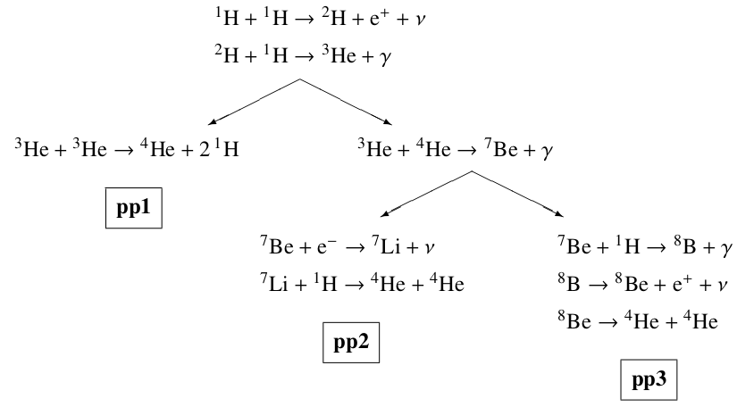

# Exercises

## List of exercises

### 1: The nuclear timescale

Compute the nuclear timescale $\tau_{\mathrm{nuc}}$

$$\tau_{\mathrm{nuc}}=\phi f_{\mathrm{nuc}}\dfrac{Mc^2}{L}$$
 
for these three reference values of stars masses: $M_1=1\:M_{\odot}$, $M_2=10\:M_{\odot}$ and $M_3=100\:M_{\odot}$. Here above, we called $\phi$ the efficiency of energy conversion for the fueling nuclear reaction, and $f_{\mathrm{nuc}}\simeq 0.1$ the fraction of the star's mass which may serve as nuclear fuel. We are going to calculate this timescale **during the Main Sequence** (MS), when the nuclear energy is provided by the pp-chain and/or the CNO cycle. The net reaction for hydrogen fusion after the annihilation of
positrons is:

$$4^1\mathrm{H}+4e\rightarrow ^4\mathrm{He}+2e+2\nu$$

Atomic masses include electron masses, so the net energy of the process (ignoring energy
losses due to neutrinos) can be computed by taking the mass difference,

$$E=\frac{4m_\mathrm{H}-m_\mathrm{He}}{m_\mathrm{u}}c^2,$$

where $m_\mathrm{H}$ and $m_\mathrm{He}$ are the atomic masses of the hydrogen and helium atom respectively.

- First compute the energy release $E$ for hydrogen fusion taking into account the atomic masses of hydrogen and helium.

  | **element** | $Z$ | $A$ | $m/m_u$ |
  |:-----------:|:---:|:---:|:----------:|
  |    **H**    |  1  |  1  |  1.007825  |
  |    **He**   |  2  |  4  |  4.002603  |

  Remember that $m_u$ is defined as $1/12$ times the mass of the $^{12}\mathrm{C}$ atom. Also, the electron mass is $m_e=9.109382\times 10^{-28}\:\mathrm{g}$, therefore $m_{e}/m_u=0.00054854$. You may want to use the useful identity 

$$m_u c^2\simeq 931\:\mathrm{MeV}=0.00149\:\mathrm{erg}\:.$$

- Later on we will show that for stars burning hydrogen through the mainly through the PP
chain, their mass luminosity relationship in the zero age main sequence (ZAMS) is approximately: 

  $$L_{\mathrm{ZAMS}}\propto M_{\mathrm{ZAMS}}^{5}\:,$$ 

  compute $\tau_{\mathrm{nuc}}$ (see exercise of part 1) for stars of $1M_\odot$, $10M_\odot$ and a $100M_\odot$ using the solar luminosity as a reference point. You will assume that your star will have a constant $L_{\mathrm{ZAMS}}$ throughout all its MS lifetime.

- From detailed calculations, it's shown that for very high mass stars $\gtrsim 100\:M_{\odot}$ the ZAMS mass-luminosity relation becomes linear. What is the main implication of this fact? And how does $\tau_{\mathrm{nuc}}$ change?

### 2: Temperature dependence of reaction rates

We saw in class that the thermally averaged reaction cross-section $\left<\sigma v\right>$ can be written as

$$\left<\sigma v\right>=(8/\pi m)^{1/2}(k_{\mathrm{B}}T)^{-3/2}S(E_0)\int_0^{\infty}\underbrace{\exp{\left(-\dfrac{E}{k_{\mathrm{B}}T}-\dfrac{b}{E^{1/2}}\right)}}_{\equiv f(E)}\:dE\:,$$

where $S(E_0)$ is the astrophysical S-factor (~constant outside resonances) and we defined the function $f(E)$, referred to as **Gamow peak**, being a very sharply peaked function around an energy value $E_0$. Also remember that $b\approx Z_iZ_jA^{1/2}$ with $A\equiv A_iA_j/(A_j+A_i)$, setting the proportionality of the Gamow factor to the Coulomb barrier and the types of nuclei.

1. Show that the Gamow peak energy $E_0$ is

   $$E_{0}=\left(\dfrac{1}{2}bk_{\mathrm{B}}T\right)^{2/3}\approx (Z_i^2Z_j^2AT^2)^{1/3}$$

2. Show that $f(E_0)$ gives

   $$f(E_0)=\exp{\left(-\dfrac{3E_0}{k_{\mathrm{B}}T}\right)}\equiv e^{-\tau}\:,$$

   where we defined $\tau$ for future convenience.

3. Now consider a Gaussian centered in $E_0$ with width $\Delta E$:

   $$f(E)\approx f_{\mathrm{GAUSS}}(E)=f(E_0)\exp{\left[-\left(\dfrac{E-E_0}{\Delta E}\right)^2\right]}\:.$$

   Since the function $f(E)$ is sharply peaked around a $E_0$, we can take this Gaussian as a good approximation of the Gamow peak. Consider the $f(E)$ expansion to second order around $E_0$:

   $$f(E)=f(E_0)+f'(E_0)(E-E_0)+\dfrac{1}{2}f''(E_0)(E-E_0)^2+...$$

4. Show that the width $\Delta E$ of the Gaussian $f_{\mathrm{GAUSS}}(E)$ satisfies

   $$\Delta E=\left(\dfrac{4}{3}E_0 k_{\mathrm{B}}T\right)^{1/2}\:.$$

5. By using the built Gaussian function $f_{\mathrm{GAUSS}}(E)$, show that you can approximate the thermally averaged cross section $\left<\sigma v\right>$ in the following manner:

   $$\left<\sigma v\right>\approx\dfrac{8}{9}\left(\dfrac{2}{3m}\right)^{1/2}\dfrac{S(E_0)}{b}\tau^2e^{-\tau}\hspace{0.5cm}\Rightarrow\hspace{0.5cm}\left<\sigma v\right>\propto \dfrac{1}{T^{2/3}}\exp{\left(-\dfrac{C}{T^{1/3}}\right)}\:,$$

   with $C$ being a number dependent on the Coulomb barrier $Z_iZ_j$. To do so, remember this tabulated Gaussian integral:

   $$\int_{-\infty}^{+\infty}e^{-\alpha x^2}dx=\sqrt{\dfrac{\pi}{\alpha}}\:.$$

6. Finally, show that, if you consider a small range of temperatures around some value $T_0$, you can write

   $$\left<\sigma v\right>=\left<\sigma v\right>|_{T=T_0}\left(\dfrac{T}{T_{0}}\right)^{\nu}\hspace{0.75cm}\mathrm{with}\hspace{0.5cm}\nu\equiv\dfrac{\partial \log \left<\sigma v\right>}{\partial\log T}=\dfrac{\tau-2}{3}\:,$$

### 3: Energetics of the pp-chains

Let's study the $Q$-value of the three pp-chains. Remember that the definition of the $Q$-value for a nuclear reaction is

$$Q\equiv (m_X+m_a-m_Y-m_b)c^2\hspace{0.75cm}\mathrm{with}\hspace{0.25cm}X+a\rightarrow Y+b\:,$$

where we are schematizing a reaction of the nucleus $X$, of mass $m_Y$, with a particle $a$, of mass $m_a$ which produces a nucleus $Y$ and a particle $b$, with masses $m_Y$ and $m_b$ respectively. Recalling the scheme of the three pp-chains

you can see that three of the reactions in the chains are accompanied by neutrino emission. The average neutrino energy $\left<E_{\nu}\right>$ is different in each chain:

$^1\mathrm{H}+^1\mathrm{H}\rightarrow ^2\mathrm{H}+e^++\nu\hspace{1cm}$ gives $\left<E_{\nu}\right>=0.265\:\mathrm{MeV}$

$^7\mathrm{Be}+e^-\rightarrow ^7\mathrm{Li}+\nu\hspace{1cm}$ gives $\left<E_{\nu}\right>=0.814\:\mathrm{MeV}$

$^8\mathrm{B}\rightarrow ^8\mathrm{Be}+e^++\nu\hspace{1cm}$ gives $\left<E_{\nu}\right>=6.71\:\mathrm{MeV}$

Considering these energy losses calculate the total effective $Q$-value for the production of one $^4\mathrm{He}$ nucleus in each chain.

## Solutions

### 1: The nuclear timescale

TODO

If we take into account the caveat that $L_{\mathrm{ZAMS}}\propto M_{\mathrm{ZAMS}}$ for very high masses $\gtrsim 100\:M_{\odot}$, then we obtain that the nuclear timescale becomes basically independent on the mass of the stars. Owing to this, the above expression. underestimates the lifetime of the most massive stars, which turns
out to be about $2\;\mathrm{Myrs}$.

### 2: Temperature dependence of reaction rates

1. The Gamow peak energy $E_0$ can be found by taking the first derivative of $f(E)$ and setting it equal to zero:

   $$\displaystyle\dfrac{df}{dE}=\dfrac{d}{dE}\left[\exp{\left(-\dfrac{E}{k_{\mathrm{B}}T}-\dfrac{b}{E^{1/2}}\right)}\right]=\exp{\left(-\dfrac{E}{k_{\mathrm{B}}T}-\dfrac{b}{E^{1/2}}\right)}\left(-\dfrac{1}{k_{\mathrm{B}}T}+\dfrac{b}{2E^{3/2}}\right)$$

   $$\displaystyle\left.\dfrac{df}{dE}\right|_{E=E_0}\overset{!}=0\hspace{0.5cm}\Leftrightarrow\hspace{0.5cm}E_0=\left(\dfrac{1}{2}bk_{\mathrm{B}}T\right)^{2/3}\:.$$

   The dependence on the Coulomb barrier comes directly from the definition of $b$.

2. The expression comes directly from evaluation:

   $$\displaystylef(E_0)=\left.\exp{\left(-\dfrac{E}{k_{\mathrm{B}}T}-\dfrac{b}{E^{1/2}}\right)}\right|_{E=E_0}=\exp{\left[-\dfrac{E_0}{k_{\mathrm{B}}T}-2^{1/3}\left(\dfrac{b^2}{k_{\mathrm{B}}T}\right)^{1/3}\right]}=$$

   $$\displaystyle=\exp{\left[-\dfrac{E_0}{k_{\mathrm{B}}T}-\dfrac{2E_0}{k_{\mathrm{B}}T}\right]}=\exp{\left(-\dfrac{3E_0}{k_{\mathrm{B}}T}\right)}\equiv e^{-\tau}\:.$$

3. The width $\Delta E$ of the Gaussian can be found by computing the second derivatives of $f_{\mathrm{GAUSS}}(E)$ and $f(E)$ and comparing them. Remember also that $f'_{\mathrm{GAUSS}}(E_0)=0=f'(E_0)$.

   $$\displaystyle\dfrac{d^2f}{dE^2}=\dfrac{d}{dE}\left[\exp{\left(-\dfrac{E}{k_{\mathrm{B}}T}-\dfrac{b}{E^{1/2}}\right)}\left(-\dfrac{1}{k_{\mathrm{B}}T}+\dfrac{b}{2E^{3/2}}\right)\right]=$$

   $$\displaystyle=f(E)\left(-\dfrac{3}{4}bE^{-5/2}\right)+f'(E)\left(-\dfrac{1}{k_{\mathrm{B}}T}+\dfrac{b}{2E^{3/2}}\right)$$

   $$\displaystyle\Rightarrow\hspace{0.5cm}\left.\dfrac{d^2f}{dE^2}\right|_{E=E_0}=f(E_0)\left(-\dfrac{3}{4}bE_0^{-5/2}\right)+0=-\dfrac{3}{2}e^{-\tau}\dfrac{1}{k_{\mathrm{B}}TE_0}=-\tau e^{-\tau}\left(\dfrac{1}{2E_0^2}\right)$$

   $$\displaystyle\dfrac{d^2f_{\mathrm{GAUSS}}}{dE^2}=f'(E)\left[-\dfrac{2}{\Delta E^2}(E-E_0)\right]+f(E)e^{\left[(E-E_0)/\Delta E\right]^2}\left[-\dfrac{2}{\Delta E^2}\right]$$

   $$\displaystyle\Rightarrow\hspace{0.5cm}\left.\dfrac{d^2f_{\mathrm{GAUSS}}}{dE^2}\right|_{E=E_0}=f(E_0)\left[-\dfrac{2}{\Delta E^2}\right]=-\dfrac{2}{\Delta E^2}e^{-\tau}\:.$$

   The outcome of the comparison follows:

   $$\displaystyle\dfrac{d^2f}{dE^2}\overset{!}=\dfrac{d^2f_{\mathrm{GAUSS}}}{dE^2}$$

   $$\displaystyle\Leftrightarrow\hspace{0.5cm}-\tau e^{-\tau}\left(\dfrac{1}{2E_0^2}\right)\overset{!}=-\dfrac{2}{\Delta E^2}e^{-\tau}\hspace{0.5cm}\Leftrightarrow\hspace{0.5cm}\Delta E=\left(\dfrac{4}{3}E_0 k_{\mathrm{B}}T\right)^{1/2}\:.$$

4. By approximating $f(E)\approx f_{\mathrm{GAUSS}}(E)$, you can write

   $$\displaystyle\int_0^{\infty}f(E)dE\approx\int_0^{\infty}f_{\mathrm{GAUSS}}(E)dE=e^{- \tau}\int_0^{\infty}\exp{\left[-\left(\dfrac{E-E_0}{\Delta E}\right)\right]}dE=e^{-\tau}\sqrt{\pi}\Delta E\:.$$

   So now it's just a matter of algebraic manipulations:

   $$\displaystyle\left<\sigma v\right>\approx\left(\dfrac{8}{\pi m}\right)^{1/2}(k_{\mathrm{B}}T)^{-3/2}S(E_0)e^{-\tau}\sqrt{\pi}\left(\dfrac{4}{3}E_0k_{\mathrm{B}}T\right)^{1/2}=$$

   $$\displaystyle=\dfrac{8}{9}\left(\dfrac{2}{3m}\right)^{1/2}\dfrac{S(E_0)}{b}\tau^2e^{-\tau}\:.$$

   The temperature dependence in this expression can be recognized by recalling that $E_0\propto T^{2/3}$, so that $\tau\equiv 3E_0/k_{\mathrm{B}}T\propto T^{2/3} T^{-1}=T^{-1/3}$. Thus, $\tau^2\propto T^{-2/3}$, and immediately:

   $$\displaystyle\left<\sigma v\right>\propto \dfrac{1}{T^{2/3}}\exp{\left(-\dfrac{C}{T^{1/3}}\right)}\:.$$

5. The definition of the exponent $\nu$ simply comes from:

   $$\displaystyle\log \left<\sigma v\right>=\mathrm{const}-\dfrac{2}{3}\log T-\tau$$

   $$\displaystyle\Rightarrow\hspace{0.5cm}\dfrac{d\log \left<\sigma v\right>}{d\log T}=-\dfrac{2}{3}-\tau\dfrac{d\log\tau}{d\log T}=-\dfrac{2}{3}+\dfrac{\tau}{3}\equiv \nu\:,$$

   where in the last equality we used $\tau\sim T^{-1/3}$.

### 3: Energetics of the pp-chains

Solution comes from direct calculation of Q-values. As the electrons contain