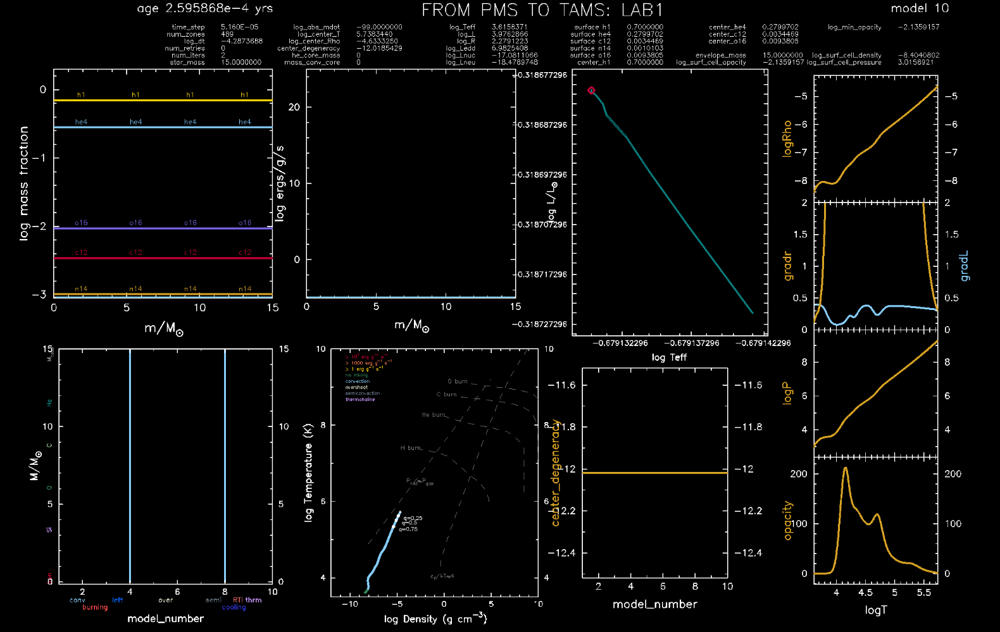

# Questions

## Preliminary instructions
Download the input files from here [input_files_LAB1](assets/lab1_input.tar.xz). After decompressing your download, put the content in the ```MESA_LAB1``` directory:

```bash
# Move to the directory of your choice
cd MESA_LAB1
# Decompress the downloaded file
tar -xf lab1_input.tar.xz
# Copy all the input files and put them in place of the ones already present in the MESA_LAB1 folder
cp -R ./lab1_input/* .
```

Consult the table of masses and find your team number. In the pair of assigned masses, pick your mass $M$ and put it as initial condition for your simulation. To do so, open your ```inlist_project``` file and edit it as follows, assuming that your mass for the simulation 1 is $M=X\:M_{\odot}$:
```fortran

&star_job
    [...]
    ! save a model at the end of the run
        save_model_when_terminate = .false.
        save_model_filename = 'XMsun_at_TAMS.mod'

        write_profile_when_terminate = .true.
        filename_for_profile_when_terminate = 'XMsun_at_TAMS_profile.data'
    [...]
/ ! end of star_job namelist

[...]

&controls
    ! starting specifications
        initial_mass = X ! in Msun units
    [...]
    ! output controls
        log_directory = 'LOGS_XMsun'
        photo_directory = 'photos_XMsun'
    [...]
/ ! end of controls namelist

[...]

&pgstar
    ! file output
    Grid1_file_flag = .true.
    Grid1_file_dir = 'grid_png_XMsun'
    Grid1_file_prefix = 'grid_XMsun_'
    [...]
/ ! end of pgstar namelist

```

You are good to go: run the simulation 1 using the [instructions](https://orlox.github.io/stars_2023_2024/dev/) and look at the dynamic plots attentively; the run should be smooth and fast. If you did everything correctly, you should be able to see something like the window below popping out in your screen:



Once the simulation 1 is done, edit your ```inlist_project``` as above, but this time assuming that your mass for the simulation 2 is $M'=X'\:M_{\odot}$: substitute every $X$ value with your $X'$ value. This is necessary to avoid overwriting your previous output.

🚨 **ATTENTION** 🚨  
Before leaving the session, save your ```MESA_LAB1``` folder somewhere: your local machines / USB memory / personal folder in the system. In the following, I am going to assume that you are at home writing your report: specifically, you are **student A** assigned with mass $M=X\:M_{\odot}$ for your simulation 1, and you will use $M'\neq M$ just to answer the question on  *Massive vs Low Mass evolution* and for a small part of the question on *Variations of the EoS: Radiation Pressure and Degeneracy*. 

## I. The Pre Main Sequence and Main Sequence (2 pts)
You evolved a model star with initial mass $M$ along the Pre Main Sequence (PMS) phases and its Main Sequence (MS):
   
- **PMS**:  
     Phase of the evolution in which the star is just formed but still too cold to ignite hydrogen burning in the core; the star contracts due to gravity, and thanks to the virial theorem in action its internal energy increases, until the conditions in its core are suitable for the first nuclear reactions to start. When hydrogen burning starts, we finally talk about Main Sequence.
   
   

   

- **MS**:  
     Phase of the evolution in which the star is burning hydrogen in its core; stars will spend roughly $~90\%$ of their lives in this stage. We can also give two other useful names: 
  
  - ZAMS:  
          Zero Age Main Sequence, point in stellar evolution when the star joins the Main Sequence;
        
  - TAMS:  
           Terminal Age Main Sequence, point in stellar evolution when the star has burnt all hydrogen in its core.
        
    
   
   


1. **ORDERS OF MAGNITUDE**  

   Compute the dynamical ($\tau_{\mathrm{dyn}}$), Kelvin-Helmholtz ($\tau_{\mathrm{KH}}$) and nuclear ($\tau_{\mathrm{nuc}}$) timescales expected for your star with mass $M=X\:M_{\odot}$ **at ZAMS**. To do so, remember the exercise from lecture [2](https://orlox.github.io/stars_2022_2023/history) in which you found

   $$\tau_{\mathrm{dyn}}\approx\sqrt{\dfrac{R^3}{GM}}\approx 0.02\left(\dfrac{R}{R_{\odot}}\right)^{3/2}\left(\dfrac{M_{\odot}}{M}\right)^{1/2}\:\mathrm{days},$$
   $$\tau_{\mathrm{KH}}\approx\dfrac{GM^2}{2RL}\approx 1.5\times 10^7\left(\dfrac{M}{M_{\odot}}\right)^2\dfrac{R_{\odot}}{R}\dfrac{L_{\odot}}{L}\:\mathrm{yr},$$
   $$\tau_{\mathrm{nuc}}\approx 10^{10}\dfrac{M}{M_{\odot}}\dfrac{L_{\odot}}{L}\:\mathrm{yr}.$$

   You will have to give a look at the ```./LOGS_XMsun/history.data``` file. You should be able to read the information you need from those columns. **NB**: the ```star_age``` column that you'll use as a check is in unit of years!

   *Hint I*: What we call ZAMS is actually an arbitrary definition on which literature doesn't agree. A good way to find the start of the ZAMS is to look into the nuclear reaction rates luminosity $L_{\mathrm{nuc}}$ (see column ```log_Lnuc```, in $L_{\odot}$ units) and see if it is a significant fraction ($\sim 90\%$) of the total surface luminosity, ```luminosity```, in $L_{\odot}$ units.

   * After reaching the ZAMS, your star should start burning hydrogen in its core. Try and plot the total surface luminosity as compared to the total hydrogen burning luminosity (which is the only contribution to your $L_{\mathrm{nuc}}$ during the MS).

   *Hint II*: You should find the interesting information in the columns ```luminosity```, ```log_R``` (which is $\log_{10}R(R_{\odot})$) and ```log_LH``` of your ```history.data``` file. 

2. **TIMESCALE OF MS PHASE**  

   How much time $\tau_{\mathrm{MS}}$ does your star spend in the MS phase in the simulation? To which order of magnitude estimate above would you associate this timescale? What does this mean in terms of the star's equilibrium?

3. **TIMESCALE OF PMS PHASE**  

   How much time $\tau_{\mathrm{PMS}}$ does your star spend in the PMS phase in the simulation? To which order of magnitude estimate above would you associate this timescale? What does this mean in terms of the star's equilibrium?

## II. The Virial Theorem (5 pts)
You will now verify that the virial theorem is in action during your star's evolution. To do so, we will start by computing the total energy reservoir $E_{\mathrm{tot}}$ of your star. Remember that the total energy is given, at each timestep, by

$$E_{\mathrm{tot}}=E_{\mathrm{gr}}+E_{\mathrm{int}}+E_{\mathrm{kin}}\:,$$

where $E_{\mathrm{gr}}$ stands for gravitational potential energy, $E_{\mathrm{int}}$ for internal energy and $E_{\mathrm{kin}}$ is the energy associated to bulk motions pf gas inside the star, which is different from $E_{\mathrm{int}}$, being due to the thermal motions of the gas particles.

1. **GRAVITATIONAL POTENTIAL ENERGY**  

   Compute the gravitational potential energy $E_{\mathrm{grav}}$ of your star **at ZAMS**. You will have to give a look at the ```./LOGS_XMsun/profileN.data```, where N corresponds to the number of profile which is closer to being the profile of your star at ZAMS. Do it directly from the formal definition:

   $$E_{\mathrm{grav}}\equiv -\int_0^M\:\dfrac{Gm}{r(m)}dm\:.$$

   *Hint*: From the previous step, you should have been able to determine which model along the evolutionary track corresponds to the ZAMS one. The mapping from this number to the right profile is straightforward, once you give a look at a file called ```./LOGS_XMsun/profiles.index```. You should use the information printed on the columns ```rmid``` (radial coordinate of the cell in $R_{\odot}$), ```mmid``` (mass coordinate of the cell in $M_{\odot}$) and ```dm``` (cell mass in grams).

2. **INTERNAL ENERGY**

   Compute the internal energy $E_{\mathrm{int}}$ of your star at ZAMS. Do it directly from the formal definition:

   $$E_{\mathrm{int}}\equiv\int_0^M\:u(m)dm\:,$$

   where $u=u(m)$ is the specific (per unit mass) internal energy of each cell at mass coordinate $m$. You should be able to find the information in the column ```energy``` (internal energy (ergs/g)).

3. **TOTAL ENERGY**

   Compute the internal energy $E_{\mathrm{kin}}$ of your star **at ZAMS**. Remember that your star is supposed to be in hydrostatic equilibrium: this should already give you a hint on $E_{\mathrm{kin}}$. If you don't know how to calculate it, give a look at a column called ```cell_specific_KE```, which stands for specific kinetic energy of a single cell (ergs/g) and convince yourself about what you see.  
   You now have all the ingredients to compute $E_{\mathrm{tot}}=E_{\mathrm{gr}}+E_{\mathrm{int}}+E_{\mathrm{kin}}$. Is your system bound at ZAMS?

4. **VIRIAL THEOREM**

   Let us now verify that (and how) the virial theorem, always valid in theory under the assumption of spherical symmetry and hydrostatic equilibrium, is actually at work in our simulation. Remember that this theorem connects two important energy reservoirs of the star, i.e. $E_{\mathrm{grav}}$ and $E_{\mathrm{int}}$, and it allows us to interpret the star's phases of evolution. 
   Remember that the most general form of the virial theorem is the following:  

   $$\mathrm{VIRIAL\: THEOREM}\hspace{2cm}\int_0^M\:\dfrac{P}{\rho}dm=-\dfrac{1}{3}E_{\mathrm{gr}}\:,$$

   with $P=P(m)$ and $\rho=\rho(m)$ being the pressure and density profiles along the star's structure. You already computed $E_{\mathrm{gr}}$ in the previous steps; compute now the left-hand-side (LHS) of the equation **at ZAMS**, and verify the theorem! Do you expect it to hold at all timesteps too or just at ZAMS?

   *Hint*: You should be able to find the information you need in the columns ```logRho``` and ```logP``` of your ```profileN.data``` file. Also: all the logarithms you'll encounter are in base 10. 

5. **THE EQUATION OF STATE**  
   
     During your class you derived the following form of the virial theorem in the particular case of perfect, non-relativistic and monoatomic gas:

     $$u=\dfrac{3}{2}\dfrac{K_{\mathrm{B}}T}{\mu m_{\mathrm{u}}}=\dfrac{3}{2}\dfrac{P}{\rho}\hspace{0.25cm}\Rightarrow\hspace{0.5cm}E_{\mathrm{int}}=-\dfrac{1}{2}E_{\mathrm{gr}}\:,$$

     where the internal energy per unit mass $u$ comes from the perfect gas assumption: the kinetic energy per particle sums up to the total internal energy of an ideal monoatomic gas, and from statistical mechanics this is equal to $3/2 K_{\mathrm{B}}T$. If we now relax the assumption of non-relativistic and monoatomic gas (but keeping it perfect, i.e. non-ideal effects are not in action), we can write the specific internal energy $u$ in a more general form, and thus derive the correspondent form of the virial theorem:

     $$u=\phi\dfrac{P}{\rho}\hspace{0.25cm}\Rightarrow\hspace{0.5cm}E_{\mathrm{int}}=-\dfrac{1}{3}\phi E_{\mathrm{gr}}\:,$$

     under the assumption of $\phi=\mathrm{const}$ along the star structure. Write the expression of the total energy $E_{\mathrm{tot}}$ of your star and find out the $\phi$-dependent condition under which your system remains bound.  
     You also have all the ingredients to find out the value of this $\phi$ for your simulation **at ZAMS**: how close is it to be $\phi=3/2$? What do you think can be the reason behind the departure, if there's any?

6. **CHECK ALONG THE EVOLUTION**

   Up to now, you worked with a particular profile, i.e. the solution of the stellar structure equations at a fixed timestep. What you can also do is to verify the form of the virial theorem along the entire evolutionary track. Assume that $\phi=3/2$ (you already discussed the goodness of the assumption at ZAMS), and do the check by plotting $E_{\mathrm{int}}$ and $-1/2 E_{\mathrm{gr}}$ at each timestep. At which point(s) of the evolution do you see the worst (or best) agreement? Motivate.  
   Plot, together with the above two quantities, also $E_{\mathrm{tot}}$; can you tell, by virtue of the virial theorem in hold, what is happening during the evolution of your star?

   *Hint*: You should be able to find the information you need in the columns ```total_gravitational_energy```, ```total_internal_energy``` and ```tot_E``` of your ```history.data``` file. I suggest to use, as x-axis, a quantity that can monotonically trace the evolution of your star, for example its age. And try to highlight the ZAMS as well.


## III. Convection and Energy Transport (4 pts)
During the early PMS phase, the star's structure is almost completely convective: opacity of outer layers is so high, due to the very low temperatures, that radiative energy transport is made inefficient and the convective envelope is sinking so deep in the star that almost the entire structure experiences convection. 

   1. Convince yourself that all of the above holds for your model **during the first stages of   the PMS**. In your lectures you studied a formal criterion, the *Schwarzschild criterion*, for stability against convection:

      $$\mathrm{SCHWARZSCHILD\: CRITERION}\hspace{2cm}\nabla_{\mathrm{rad}}\equiv\dfrac{3}{16\pi a c G}\dfrac{P}{T^4}\dfrac{\kappa l}{m}<\nabla_{\mathrm{ad}}$$

      where $a=7.566\times 10^{-15}\:\mathrm{erg}\:\mathrm{cm}^{-3}\:\mathrm{K}^{-4}$ is the radiation constant, $P=P(m)$, $T=T(m)$, $\kappa=\kappa (m)$ and $l=l(m)$ are the pressure, temperature, opacity and luminosity profiles along the stellar structure; $\nabla_{\mathrm{ad}}$ and $\nabla_{\mathrm{rad}}$ are the adiabatic and radiative temperature gradients. Verify that there's a stage of the evolution in which convection happens *globally* in your star. You might want to produce a plot like one of those present in your saved pngs to support your argument.

   2. Remember the [exercise](https://orlox.github.io/stars_2023_2024/dev/6_convection_problems/) in which we showed that $\nabla_{\mathrm{ad}}= 0.4$ for an ideal gas without radiation. How close is the $\nabla_{\mathrm{ad}}$ of your simulation to be $\nabla_{\mathrm{ad}}\simeq 0.4$ in this stage? Motivate why $\nabla_{\mathrm{ad}}$ drops below $0.4$ around the outer layers of your star and why, close to your core, that value is almost correct.
   3. How is the actual temperature gradient as compared to the adiabatic one? Remember that in class we mentioned that, very often, one can make the approximation $\nabla\approx\nabla_{\mathrm{ad}}$ in convective regions. Compute the degree of superadiabaticity $\nabla-\nabla_{\mathrm{ad}}$ and discuss the goodness of the approximation in your simulation. 
   4. How long does your star stay completely convective? I.e., how relevant is this stage of evolution with respect to the total age of your star?

   *Hint I*: You can select the completely convective model during the PMS by looking at the ```grid_XMsun.png``` files, in particular at the Kippenhahn diagram, i.e. the one showing mass coordinates $m/M_{\odot}$ of interesting zones as a function of the model number. When the light blue region spans the entire mass range, you have convection over all you structure. The mapping from model number to the right ```profileN.data``` should be straightforward from the ```profiles.index``` file.

   *Hint II*: You should be able to find the useful information in the columns ```grada``` (adiabatic temperature gradient), ```gradr``` (radiative temperature gradient), and ```actual_gradT``` (actual temperature gradient).

## IV. Variations of the EoS: Radiation Pressure and Degeneracy (3 pts)
We will start by studying the contribution, to the EoS, of the gas of photons, i.e. the **radiation pressure** contribution $P_{\mathrm{rad}}$. Until now, you discussed the goodness of the ideal gas assumption for your model, and extensively showed its action along the evolution of your system. But does it mean that the photons' contribution is not even there, or not important?

Remember that in general the pressure inside a star is **the sum** of the gas pressure and radiation pressure. For an ideal gas with a radiation contribution, we can write

$$P=P_{\mathrm{gas}}+P_{\mathrm{rad}}=P_{\mathrm{ions}}+P_{\mathrm{e}}+P_{\mathrm{rad}}=\dfrac{\mathcal{R}}{\mu}\rho T+\dfrac{1}{3}a T^4\:$$
$$\mathrm{with}\hspace{0.5cm}\mathcal{R}=8.31447\times 10^{7}\:\mathrm{erg}\:\mathrm{g}^{-1}\:\mathrm{K}^{-1}\:,$$
$$a=7.56578\times 10^{-15}\:\mathrm{erg}\:\mathrm{cm}^{-3}\:\mathrm{K}^{-4}\:,$$

where $P_{\mathrm{e}}$ is the contribution of free electrons, $P_{\mathrm{ions}}$ the one from ions, $\mathcal{R}$ is universal gas constant and $a$ is the radiation constant. Be aware this form of $P_{\mathrm{gas}}=\mathcal{R}/\mu \rho T$ is implying that we are considering the gas of electrons to be non-degenerate (see below).

1. **THE FRACTION OF RADIATION**

   Let's examine the profile concerning the **TAMS** stage of your simulation. Finding this profile is particularly easy, since it's the last one printed from your simulation run, and you will find it as it is called ```XMsun_at_TAMS_profile.data```, in your top level of the ```MESA_LAB1``` directory. 

   - Plot the total pressure $P$, the radiation pressure $P_{\mathrm{rad}}$ and the gas pressure $P_{\mathrm{gas}}$ contributions all together for the profile **at TAMS**. Quantify the impact of the radiation pressure contribution by defining a fraction $\beta$ as follows

     $$P_{\mathrm{gas}}=\beta P\hspace{0.5cm}\mathrm{and}\hspace{0.5cm}P_{\mathrm{rad}}=(1-\beta)P\:.$$

     Notice that this $\beta$ will vary along your star's structure; comment on the order of magnitude of your $\beta$ and on the regions in which it is higher / lower.

     *Hint*: Look at the columns ```pressure```, ```prad``` and ```pgas```.

  
Let us now see whether neglecting the contribution of **degeneracy pressure** from electrons, thus treating them as classical particles following $P_e=\mathcal{R}/\mu \rho T$, is a good assumption or not. From statistical mechanics, we know that Pauli exclusion principle forces degenerate electrons to pile up in levels with higher and higher momentum, till the maximum occupied level with the Fermi momentum $p_{\mathrm{F}}$. On the other hand, if the electron gas is classical, the particles are following a Maxwell-Boltzmann like distribution, with a maximum momentum given by $p_{\mathrm{max}}$, see [lecture on Degenerate EOS](https://orlox.github.io/stars_2023_2024/dev/4_eos2/#Polytropes-and-the-Chandrasekhar-mass). More specifically,

   $$p_{\mathrm{F}}=h\left(\dfrac{3}{8\pi}n_e\right)^{1/3}\:,\hspace{0.5cm}p_{\mathrm{max}}=\sqrt{2m_eK_{\mathrm{B}}T}\:,$$

   with $n_e$ being the number density of free electrons in the stellar gas, $h=6.626\times 10^{-27}\:\mathrm{erg}\:\mathrm{s}$ is the Planck constant and $m_{e}=9.109\times 10^{-28}\:\mathrm{g}$. To the purpose of quantifying the degeneracy degree in our simulation, we can refer to the following ratio  

   $$\mathrm{PROXY\: FOR\: DEGENERACY\: DEGREE}$$
   $$\dfrac{p_{\mathrm{F}}}{p_{\mathrm{max}}}$$

2. **SOME DEGENERACY DEGREE**?
   See if the above ratio is $\gtrless 1$ for the profile **at TAMS**, and assess the goodness of the classical gas assumption. In which region do you see the highest degree of degeneracy, if you have some?

   *Hint*: There is no profile column providing the value for $n_e$, you would have to calculate it yourself in a reasonable way. Remember that by definition $n_e=\rho/\mu_{e}m_{u}$, and your gas is mainly made by $H$ and $He$.

3. **COMPARISON BETWEEN MODELS**
   
   Now you'll finally use the output of your simulation 2, namely the second mass $M'=X'\:M\mathrm{\odot}$. Answer to the requests 1. and 2. of this question IV. also for this second mass, and discuss which model is more degenerate, and which one is more radiation pressure dominated.

## V. Massive vs Low Mass evolution (2 pts)

You will again use the output of your simulation 2: here the goal is to make you aware of some differences in the evolution of a low mass ($M'\gtrsim 1\:\mathrm{\odot}$) star versus a relatively higher mass ($M'\gtrsim 5\:\mathrm{\odot}$) one. You will study the differences in great detail in the following classes, but there are some key points that can be observed also along the MS.

1. **CONVECTIVE OR RADIATIVE CORE**?    
   
    Consider you models $M$ and $M'$.
    - Do they experience convection in their core, during the nuclear burning of H? What does it imply, in terms of elements abundances profiles in the core?
    - If the star has a convective core, does its size increase or decrease during the nuclear burning of H? 

    *Hint*: you can follow the information stored in ```mass_conv_core``` in your ```history.data``` file. Or, you can also answer qualitatively by looking at the Kippenhahn diagram, and the abundances profiles plot in your ```grid_XMsun.png``` and ```grid_X'Msun.png```. In this context, you can (not mandatory) include screenshots of your pgstar window to prove your point.

2. **CONVECTIVE OR RADIATIVE ENVELOPE**?

    Consider you models $M$ and $M'$. 
     - Do they experience convection in their envelope, during the nuclear burning of H? Quantify the different convective envelope masses you are seeing. 
     - Remembering the Schwarzschild criterion for stability against convection, can you motivate why you're (not) seeing a convective envelope, if that is the case?

   *Hint:* you can give a rough estimate of the envelope masses by looking at at the Kippenhahn diagram in your ```grid_XMsun.png``` and ```grid_X'Msun.png```. For the motivation on convection to occur in the envelope, I suggest to give a look at one of the other diagrams present in your pgstar window, i.e. the one showing the opacity curve 😁

3. **THE SURFACE PROPERTIES**

   Give a look at the HR diagram, i.e. the $(\log T_{\mathrm{eff}}(\mathrm{K}), \:\log L(L_{\odot}))$ plane. Plot your two tracks together in such plane, highlighting the ZAMS. 
    - Compare the orders of magnitude for the surface luminosity $\log L(L_{\odot})$ for your two stars and try to explain the difference you're seeing, in terms of the mass-luminosity relation that you saw in your lectures. Is your more massive star of the pair more luminous **at ZAMS**? By how much?

    - Compare the orders of magnitude for the effective temperature $\log T_{\mathrm{eff}}(\mathrm{K})$ for your two stars. Which star of your pair sets into ZAMS at a higher $T_{\mathrm{eff}}?$ And at TAMS?

## VI. Bonus: Radiative Opacities (➕ pts)

This bonus question is meant for you to gain a better understanding of the ingredients playing a role in computing the **radiative opacity** $\kappa$ of the stellar matter.  

1. **THE TOTAL OPACITY AT ZAMS**

   Plot the **ZAMS** profile of the total radiative opacity $\kappa$ (see column ```opacity```). This is the result of very complicated ingredients from atomic physics and chemistry blended together, but there should be some easily recognizable features.

    - Remember that the **electron scattering** opacity $\kappa_{\mathrm{es}}$, in the Thomson classical limit, can be expressed by

      $$\kappa_{\mathrm{es}}=0.20(1+X)\:\mathrm{cm}^2\:\mathrm{g}^{-1}\:,$$

      where $X\simeq 0.7$ is the hydrogen mass fraction. Where in your star can you see this feature to be the dominant one?

    - **Free-free absorption opacity** $\kappa_{\mathrm{ff}}$ accounts for the inverse process   of the *Bremsstrahlung*, in which a free electron passes by a charged nucleus and emits radiation due to the experienced acceleration. An approximate calculation was carried on by Kramers, who gave a power-law relation of this sort  
        $$\kappa_{\mathrm{ff}}\simeq \kappa_0 \rho T^{-7/2}\:\mathrm{cm}^2\:\mathrm{g}^{-1}\:,$$

       in which $\kappa_{0}$ is a constant that depends on the chemical composition. Where in your star can you see a power-law-ish trend being dominant?

    - If I remind you that Hydrogen recombines at $~ 10^4\:\mathrm{K}$, mostly independently on the density $\rho$, can you tell where (and if!) this feature is playing a role?
